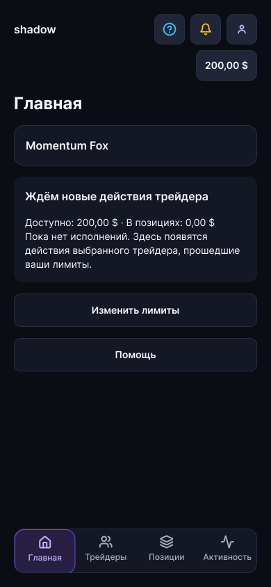
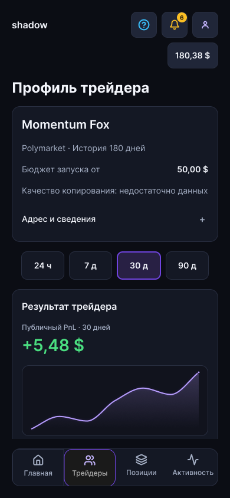

# Controlled Copy Trading

**Русский** · [English](README.en.md)

[](https://github.com/denius89/polymarket-copy-trading/actions/workflows/repository-check.yml)

Mobile-first продукт для контролируемого копирования сделок на **Polymarket** и **Limitless**: выбор трейдера, демо с виртуальными средствами, понятные лимиты и объяснение действий.

**Статус на 6 октября 2026: интерфейсы и документация, pre-MVP.** Сейчас проверяем и дорабатываем дизайн после просмотра с коллегой. Пользовательское приложение, торговые адаптеры и реальные операции ещё не реализованы. Бизнес-аудит окончательных экранов, админка и техническая реализация не входят в текущую работу.

## Открыть прототип

**[Начать здесь в Figma →](https://www.figma.com/design/lxPP2um7FvIbt02K8eeH4T?node-id=3-2)** — единая точка входа для всех версий.

| Версия | Русский | English |
| --- | --- | --- |
| Мобильная | [Mobile RU](https://www.figma.com/proto/lxPP2um7FvIbt02K8eeH4T?node-id=1839-57824&starting-point-node-id=1839%3A57824&page-id=33%3A2&scaling=scale-down) | [Mobile EN](https://www.figma.com/proto/lxPP2um7FvIbt02K8eeH4T?node-id=1839-57862&starting-point-node-id=1839%3A57862&page-id=29%3A2&scaling=scale-down) |
| Десктоп | [Desktop RU](https://www.figma.com/proto/lxPP2um7FvIbt02K8eeH4T?node-id=584-265&starting-point-node-id=584%3A265&page-id=205%3A2&scaling=scale-down) | [Desktop EN](https://www.figma.com/proto/lxPP2um7FvIbt02K8eeH4T?node-id=584-225&starting-point-node-id=584%3A225&page-id=186%3A2&scaling=scale-down) |

Каждый вход предлагает **первый запуск** и отдельное **подготовленное активное демо**. Для смены сценария используйте Restart. Мобильный первый запуск: знакомство → выбор трейдера → размер копии и лимиты → проверка → запуск → пустая главная.

Последние правки: единые шапка и нижняя навигация, восстановленный выбор трейдера, понятные подписи PnL, общий вопрос в помощи, короткие названия счетов и заголовки профиля без повторения периода. На desktop RU/EN также убран дублирующий CTA первого запуска, уточнены возврат к трейдерам и открытие подготовленного примера, а список обращений связан с общей формой. [Основной срез — 109](docs/109_latest_design_review_2026-10-06.md), [десктопное дополнение — 111](docs/111_desktop_colleague_review_fixes_2026-10-06.md).

Изображения и связи последних правок проверены. **Повторный ручной проход в Present после этих правок ещё не выполнен:** Computer Use не получил разрешение на управление приложением Figma. Проходы в [отчёте 106](docs/106_four_prototypes_acceptance_2026-10-06.md) относятся к предыдущей версии; окончательная визуальная приёмка остаётся открытой.

## Как выглядит сейчас

Макеты Figma на 06.10.2026. Данные демонстрационные; это не снимки работающего торгового приложения.

<table>
<tr><th>Новое демо</th><th>Профиль трейдера</th></tr>
<tr>
<td></td>
<td></td>
</tr>
</table>

## Что открыть по задаче

| Задача | Материал |
| --- | --- |
| Посмотреть последние интерфейсы с коллегой | [Последний результат и маршрут проверки](docs/109_latest_design_review_2026-10-06.md) |
| Понять текущую очередь | [Дорожная карта](docs/ROADMAP.md) |
| Проверить согласованные правила и открытые вопросы | [Бизнес-логика MVP](docs/MVP_BUSINESS_LOGIC.md) · [ADR](docs/decisions/README.md) |
| Найти документы по теме | [Карта документов](docs/README.md) |
| Посмотреть решения и историю работы | [Состояние проекта](docs/PROJECT_STATE.md) · [Полный каталог](docs/DOCUMENT_INDEX.md) |
| Разобраться в организации GitHub | [Результат уборки и состояние PR](docs/110_repository_navigation_cleanup_2026-10-06.md) |

При расхождении старого отчёта и текущего состояния используйте ROADMAP для очереди, последний отчёт для интерфейсов, MVP_BUSINESS_LOGIC и ADR для правил. Номер документа и слово «текущий» внутри старой записи не означают, что она описывает сегодняшний этап.

## API площадок

| Площадка | Справочник | Статус |
| --- | --- | --- |
| Polymarket | [Draft PR #14](https://github.com/denius89/polymarket-copy-trading/pull/14) | Подготовлен; проверка структуры репозитория прошла; пока не включён в main |
| Limitless | [Draft PR #15](https://github.com/denius89/polymarket-copy-trading/pull/15) | Подготовлен; проверка структуры репозитория прошла; пока не включён в main |

Это документация официальных API и свидетельства публичных чтений на 06.10.2026. Партнёрские права, исполнение, комиссии конкретного аккаунта и восстановление торгового соединения требуют отдельных проверок. Наличие справочника и успешная проверка Markdown не означают готовую интеграцию.

## Структура и проверка репозитория

```text
docs/               текущая навигация, продуктовые документы и история
docs/decisions/     согласованные и предложенные ADR
docs/preview/       актуальные изображения для обзора
design/            материалы Figma и свидетельства прошлых проверок
apps/, packages/   границы будущего приложения и адаптеров
research/          исследования
artifacts/         презентации и другие материалы
scripts/           проверка структуры и ссылок
```

Для проверки нужен Node.js 22 или новее:

```bash
npm run check
git diff --check
```

Это проверка репозитория, а не запуск приложения. Правила участия: [CONTRIBUTING](CONTRIBUTING.md), [SECURITY](SECURITY.md), [AGENTS](AGENTS.md). Презентации и прежние концепции — в [artifacts](artifacts/README.md); они не заменяют текущий статус и прототипы.
