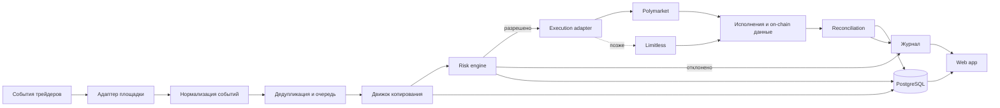

# Техническая концепция контролируемого copy trading

> Статус на 24.09.2026: документ пересматривается. Разработка MVP и интерактивного прототипа приостановлена до согласования идеи и архитектуры. Текущие выводы и приоритеты: [пересмотр](07_strategy_architecture_review.md) и [состояние проекта](PROJECT_STATE.md). Описанные экраны и технические механизмы пока не являются утверждённой спецификацией.

Статус: архитектурный черновик. Версия: 0.1 от 23 сентября 2026 года.

## 1. Цель

Построить сначала личный, затем многопользовательский некастодиальный сервис, который обнаруживает сделки выбранных трейдеров, рассчитывает безопасную копию, отправляет ордер от имени пользователя и ведёт объяснимый внутренний учёт.

Первая интеграция — Polymarket. Архитектура должна допускать отдельный адаптер Limitless, но мультиплатформенное исполнение не входит в первый MVP.

## 2. Архитектурные принципы

- Средства остаются в кошельке пользователя.
- Сервис не получает право произвольного вывода средств.
- Каждая сделка проходит локальные проверки риска до подписания и отправки.
- Вся обработка строится на идемпотентных событиях: повтор одного события не должен создавать вторую сделку.
- On-chain баланс является внешней истиной по активам, а внутренний ledger — истиной по происхождению и состоянию виртуальных лотов.
- Любое решение автоматики должно объясняться записью в журнале.
- После ручного вмешательства состояние позиции меняется явно, без скрытого возобновления копирования.
- Платформенная логика изолируется в адаптерах; риск и виртуальные лоты остаются общими.
- Сначала paper trading и малый личный капитал, затем доступ другим пользователям.

## 3. Общая схема

## 4. Компоненты

### Web app

Пять основных разделов: портфель, позиции, трейдеры, журнал и риск. Интерфейс обращается только к нашему backend API и кошельку пользователя для явно необходимых подписей.

### Backend API

Отдаёт состояние портфеля, настройки, журнал и команды управления. Проверяет права пользователя, валидирует ввод и не хранит приватный ключ в браузерном коде или базе данных.

### Market and trader ingestion

Получает публичные сделки, статусы рынков и цены через API, WebSocket и при необходимости on-chain события. Для каждого источника измеряет время получения и сохраняет необработанный payload для расследования расхождений.

### Normalizer

Преобразует события разных площадок в общую форму: площадка, трейдер, рынок, outcome, сторона, цена, количество, время источника и уникальный идентификатор.

### Copy engine

Сопоставляет событие с активной подпиской пользователя, рассчитывает желаемый размер и создаёт намерение сделки. Не отправляет ордер напрямую, пока risk engine не вернёт разрешение.

### Risk engine

Проверяет:

- максимальную сумму одной сделки;
- лимит на трейдера, рынок, категорию и весь портфель;
- минимальный свободный резерв;
- дневной лимит убытка;
- диапазон допустимой цены;
- максимальное проскальзывание;
- запрет повторного входа;
- состояние глобальной и индивидуальной остановки;
- достаточность баланса и разрешений.

Результат проверки содержит решение, использованные значения и понятную причину.

### Execution adapter

Создаёт, подписывает, отправляет, отменяет и проверяет ордера конкретной площадки. Поддерживает частичное исполнение, таймаут, повторный запрос статуса и отмену остатка.

### Virtual lot ledger

Разделяет общий on-chain баланс одного outcome token на внутренние лоты по источникам. Каждый лот хранит трейдера, исходную сделку, фактические исполнения, среднюю цену, количество, реализованный P&L и режим следования.

Состояния лота:

- `FOLLOWING` — следует действиям трейдера;
- `PARTIALLY_OVERRIDDEN` — пользователь вручную закрыл часть;
- `DETACHED` — будущие действия трейдера игнорируются;
- `CLOSED` — остаток равен нулю.

### Reconciliation worker

Регулярно сравнивает:

- внутренние ордера со статусами площадки;
- внутренние исполнения с публичными и on-chain данными;
- сумму открытых виртуальных лотов с фактическим балансом outcome token;
- рассчитанный P&L с контрольным расчётом.

Расхождение не исправляется молча: создаётся инцидент, блокируется рискованное действие и сохраняется диагностический контекст.

### Event journal

Хранит последовательность событий от обнаружения сделки до результата. Журнал предназначен одновременно для пользователя, поддержки и отладки.

## 5. Основные сущности данных

| Сущность | Назначение |
|---|---|
| `User` | владелец настроек и кошельков |
| `Wallet` | публичный адрес, площадка и тип подключения |
| `Leader` | отслеживаемый трейдер |
| `CopyPolicy` | правила размера и риска для пары пользователь–трейдер |
| `Market` | нормализованное описание рынка и outcome tokens |
| `LeaderEvent` | исходное действие трейдера |
| `CopyIntent` | рассчитанное намерение копии до проверки риска |
| `RiskDecision` | разрешение или отказ с причинами и снимком лимитов |
| `Order` | отправленный ордер и его жизненный цикл |
| `Fill` | отдельное фактическое исполнение |
| `VirtualLot` | внутренняя доля позиции с конкретным источником |
| `LotAdjustment` | ручное закрытие, отсоединение или корректировка |
| `PortfolioSnapshot` | баланс, экспозиции и P&L на момент времени |
| `JournalEvent` | объяснимая запись для пользователя и аудита |
| `ReconciliationIssue` | обнаруженное расхождение и его статус |

Денежные значения хранятся в целых минимальных единицах или точных decimal-типах. Для расчётов нельзя использовать двоичный floating point.

## 6. Жизненный цикл копии

1. Получить событие лидера и сохранить сырой payload.
2. Сформировать стабильный ключ идемпотентности.
3. Отфильтровать дубликаты и события до момента включения подписки.
4. Рассчитать размер копии по выбранной политике.
5. Получить актуальную книгу ордеров и оценить достижимую цену.
6. Выполнить все проверки риска.
7. Создать подписываемый ордер с уникальным `clientOrderId`, если площадка поддерживает его.
8. Отправить ордер и отслеживать подтверждение, частичное исполнение, отмену или отказ.
9. Создать или изменить виртуальный лот только по фактическим исполнениям.
10. Провести reconciliation с площадкой и блокчейном.
11. Записать итог, задержку, цену, проскальзывание, комиссию и причину результата в журнал.

## 7. Политики размера позиции

Для первого прототипа достаточно двух способов:

1. **Фиксированная сумма:** копировать каждую допустимую сделку на заданную сумму в USDC.
2. **Доля доступного лимита:** размер определяется долей выделенного капитала пользователя, но ограничивается абсолютным максимумом сделки.

Копирование процента от сделки лидера можно добавить после проверки качества данных. Оно трудно объясняется пользователю и может давать нестабильный риск при сильно отличающихся балансах.

Размер после округления не может превышать ни один лимит и должен учитывать доступную глубину книги в пределах допустимого проскальзывания.

## 8. Идемпотентность и конкуренция

- У каждого события лидера есть стабильный `source_event_key`.
- У каждой копии есть уникальная комбинация пользователя, политики и исходного события.
- Создание копии фиксируется транзакцией базы данных до сетевого вызова.
- Повторная отправка использует тот же клиентский идентификатор или сначала проверяет существующий ордер.
- Для одного кошелька и рынка применяется последовательная обработка конфликтующих операций.
- Sell никогда не может списать больше количества, принадлежащего соответствующим виртуальным лотам, без явного ручного решения.

## 9. Безопасность и ключи

### Личный прототип

Допустим отдельный тестовый кошелёк с небольшим балансом. Секреты хранятся локально или в менеджере секретов окружения, не попадают в репозиторий, логи и ответы Codex.

### Закрытая альфа

Перед доступом других пользователей нужно выбрать и проверить механизм ограниченной авторизации: session keys, scoped API tokens, делегированная подпись или подтверждение кошельком. Конкретный механизм зависит от актуальных возможностей площадки.

Обязательные меры:

- минимальные разрешения и возможность отзыва;
- шифрование секретов и разделение окружений;
- запрет вывода на произвольный адрес;
- rate limits, защита сессий и журнал административных действий;
- автоматическая остановка при неизвестном состоянии ордера или расхождении баланса;
- резервное ручное отключение worker-процессов;
- threat model и независимый security review перед публичным запуском.

## 10. Рекомендуемый стек личного прототипа

- **Язык:** TypeScript для интерфейса, API и workers, чтобы уменьшить число технологий.
- **Frontend:** React/Next.js с wallet connector.
- **Backend:** Node.js API и отдельный worker-процесс.
- **База данных:** PostgreSQL с транзакциями и точными decimal-типами.
- **Очередь:** сначала таблица заданий PostgreSQL; Redis или специализированная очередь добавляется при доказанной необходимости.
- **Интеграции:** официальные SDK площадок там, где они стабильны; сырые REST/WebSocket вызовы изолируются в адаптере.
- **Наблюдаемость:** структурированные логи, метрики задержки и ошибок, оповещения об остановке и reconciliation issues.
- **Развёртывание:** одно staging-окружение и одно production-окружение; личный прототип может работать на недорогом управляемом хостинге.

Выбор конкретных провайдеров делается после технических spike-задач и оценки стоимости. Сложные микросервисы, Kubernetes и собственный индексатор не нужны до подтверждения нагрузки.

## 11. Платформенный интерфейс

Каждый адаптер должен предоставлять общие операции:

- получить рынки и метаданные;
- получить книгу ордеров и достижимую цену;
- получить публичную активность адреса;
- создать, отменить и проверить ордер;
- получить исполнения, позиции и балансы;
- получить комиссии и ограничения размера;
- подписаться на real-time события;
- нормализовать ошибки и временные ограничения.

Polymarket и Limitless используют разные схемы API, аутентификации и исполнения. Общий интерфейс не должен скрывать различия, влияющие на риск; специфичные возможности сохраняются в метаданных адаптера.

## 12. Проверки до основной разработки

### Spike A: наблюдение за лидером

Для 3–5 адресов измерить полноту, порядок и задержку событий через доступные API/WebSocket/on-chain источники.

### Spike B: безопасное исполнение

На тестовом кошельке пройти полный цикл минимального ордера: allowance, подпись, отправка, частичное исполнение или отмена, получение позиции и закрытие.

### Spike C: виртуальные лоты

Смоделировать двух лидеров в одном outcome token, частичное ручное закрытие одного лота и последующий sell каждого лидера.

### Spike D: reconciliation

Искусственно пропустить событие, повторить событие и получить неизвестный статус ордера. Система должна восстановить состояние без двойной сделки.

### Spike E: Limitless

Отдельно проверить публичную историю адресов, WebSocket, order lifecycle, fee model и возможность безопасной авторизации. Результат определит, нужен ли второй адаптер после MVP.

## 13. Тестирование

- unit-тесты для расчёта размера, лимитов и P&L;
- property-based тесты для инвариантов виртуальных лотов;
- контрактные тесты адаптера на записанных безопасных ответах API;
- интеграционные тесты жизненного цикла ордера;
- симуляции дублей, задержек, частичных исполнений и перестановки событий;
- paper-trading прогон без реальных ордеров;
- малые реальные сделки только после сверки paper режима.

Ключевые инварианты:

- сумма открытых лотов не превышает фактический доступный баланс;
- одно исходное событие не создаёт две копии;
- закрытый или отсоединённый лот не возобновляет следование сам;
- сработавшая глобальная остановка запрещает новые ордера;
- любое изменение позиции объясняется сохранённым событием.

## 14. Источники и ограничения

На дату документа официальная документация Polymarket описывает market data, real-time data, wallet authentication, session keys, order lifecycle и builder program: https://docs.polymarket.com/.

Документация Limitless описывает REST/WebSocket API, публичные профили, историю, позиции, ордера, scoped tokens и partner accounts: https://docs.limitless.exchange/.

Доступность конкретных endpoint, разрешений, комиссий и партнёрских функций необходимо перепроверить непосредственно перед реализацией. Этот документ не является security audit или юридическим заключением.

