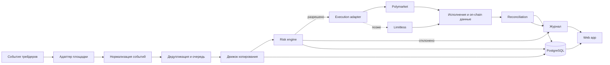

# Техническая концепция контролируемого copy trading

> Статус на 24.09.2026: документ пересматривается. Разработка MVP и интерактивного прототипа приостановлена до согласования идеи и архитектуры. Текущие выводы и приоритеты: [пересмотр](07_strategy_architecture_review.md) и [состояние проекта](PROJECT_STATE.md). Описанные экраны и технические механизмы пока не являются утверждённой спецификацией.

Статус: архитектурный черновик. Версия: 0.1 от 23 сентября 2026 года.

## 1. Цель

Построить сначала личный, затем многопользовательский некастодиальный сервис, который обнаруживает сделки выбранных трейдеров, рассчитывает безопасную копию, отправляет ордер от имени пользователя и ведёт объяснимый внутренний учёт.

Первая интеграция — Polymarket. Архитектура должна допускать отдельный адаптер Limitless, но мультиплатформенное исполнение не входит в первый MVP.

## 2. Архитектурные принципы

- Средства остаются в кошельке пользователя.
- Сервис не получает право произвольного вывода средств.
- Каждая сделка проходит локальные проверки риска до подписания и отправки.
- Вся обработка строится на идемпотентных событиях: повтор одного события не должен создавать вторую сделку.
- On-chain баланс является внешней истиной по активам, а внутренний ledger — истиной по происхождению и состоянию виртуальных лотов.
- Любое решение автоматики должно объясняться записью в журнале.
- После ручного вмешательства состояние позиции меняется явно, без скрытого возобновления копирования.
- Платформенная логика изолируется в адаптерах; риск и виртуальные лоты остаются общими.
- Сначала paper trading и малый личный капитал, затем доступ другим пользователям.

## 3. Общая схема

## 4. Компоненты

### Web app

Пять основных разделов: портфель, позиции, трейдеры, журнал и риск. Интерфейс обращается только к нашему backend API и кошельку пользователя для явно необходимых подписей.

### Backend API

Отдаёт состояние портфеля, настройки, журнал и команды управления. Проверяет права пользователя, валидирует ввод и не хранит приватный ключ в браузерном коде или базе данных.

### Market and trader ingestion

Получает публичные сделки, статусы рынков и цены через API, WebSocket и при необходимости on-chain события. Для каждого источника измеряет время получения и сохраняет необработанный payload для расследования расхождений.

### Normalizer

Преобразует события разных площадок в общую форму: площадка, трейдер, рынок, outcome, сторона, цена, количество, время источника и уникальный идентификатор.

### Copy engine

Сопоставляет событие с активной подпиской пользователя, рассчитывает желаемый размер и создаёт намерение сделки. Не отправляет ордер напрямую, пока risk engine не вернёт разрешение.

### Risk engine

Проверяет:

- максимальную сумму одной сделки;
- лимит на трейдера, рынок, категорию и весь портфель;
- минимальный свободный резерв;
- дневной лимит убытка;
- диапазон допустимой цены;
- максимальное проскальзывание;
- запрет повторного входа;
- состояние глобальной и индивидуальной остановки;
- достаточность баланса и разрешений.

Результат проверки содержит решение, использованные значения и понятную причину.

### Execution adapter

Создаёт, подписывает, отправляет, отменяет и проверяет ордера конкретной площадки. Поддерживает частичное исполнение, таймаут, повторный запрос статуса и отмену остатка.

### Virtual lot ledger

Разделяет общий on-chain баланс одного outcome token на внутренние лоты по источникам. Каждый лот хранит трейдера, исходную сделку, фактические исполнения, среднюю цену, количество, реализованный P&L и режим следования.

Состояния лота:

- `FOLLOWING` — следует действиям трейдера;
- `PARTIALLY_OVERRIDDEN` — пользователь вручную закрыл часть;
- `DETACHED` — будущие действия трейдера игнорируются;
- `CLOSED` — остаток равен нулю.

### Reconciliation worker

Регулярно сравнивает:

- внутренние ордера со статусами площадки;
- внутренние исполнения с публичными и on-chain данными;
- сумму открытых виртуальных лотов с фактическим балансом outcome token;
- рассчитанный P&L с контрольным расчётом.

Расхождение не исправляется молча: создаётся инцидент, блокируется рискованное действие и сохраняется диагностический контекст.

### Event journal

Хранит последовательность событий от обнаружения сделки до результата. Журнал предназначен одновременно для пользователя, поддержки и отладки.

## 5. Основные сущности данных

| Сущность | Назначение |
|---|---|
| `User` | владелец настроек и кошельков |
| `Wallet` | публичный адрес, площадка и тип подключения |
| `Leader` | отслеживаемый трейдер |
| `CopyPolicy` | правила размера и риска для пары пользователь–трейдер |
| `Market` | нормализованное описание рынка и outcome tokens |
| `LeaderEvent` | исходное действие трейдера |
| `CopyIntent` | рассчитанное намерение копии до проверки риска |
| `RiskDecision` | разрешение или отказ с причинами и снимком лимитов |
| `Order` | отправленный ордер и его жизненный цикл |
| `Fill` | отдельное фактическое исполнение |
| `VirtualLot` | внутренняя доля позиции с конкретным источником |
| `LotAdjustment` | ручное закрытие, отсоединение или корректировка |
| `PortfolioSnapshot` | баланс, экспозиции и P&L на момент времени |
| `JournalEvent` | объяснимая запись для пользователя и аудита |
| `ReconciliationIssue` | обнаруженное расхождение и его статус |

Денежные значения хранятся в целых минимальных единицах или точных decimal-типах. Для расчётов нельзя использовать двоичный floating point.

## 6. Жизненный цикл копии

1. Получить событие лидера и сохранить сырой payload.
2. Сформировать стабильный ключ идемпотентности.
3. Отфильтровать дубликаты и события до момента включения подписки.
4. Рассчитать размер копии по выбранной политике.
5. Получить актуальную книгу ордеров и оценить достижимую цену.
6. Выполнить все проверки риска.
7. Создать подписываемый ордер с уникальным `clientOrderId`, если площадка поддерживает его.
8. Отправить ордер и отслеживать подтверждение, частичное исполнение, отмену или отказ.
9. Создать или изменить виртуальный лот только по фактическим исполнениям.
10. Провести reconciliation с площадкой и блокчейном.
11. Записать итог, задержку, цену, проскальзывание, комиссию и причину результата в журнал.

## 7. Политики размера позиции

Для первого прототипа достаточно двух способов:

1. **Фиксированная сумма:** копировать каждую допустимую сделку на заданную сумму в USDC.
2. **Доля доступного лимита:** размер определяется долей выделенного капитала пользователя, но ограничивается абсолютным максимумом сделки.

Копирование процента от сделки лидера можно добавить после проверки качества данных. Оно трудно объясняется пользователю и может давать нестабильный риск при сильно отличающихся балансах.

Размер после округления не может превышать ни один лимит и должен учитывать доступную глубину книги в пределах допустимого проскальзывания.

## 8. Идемпотентность и конкуренция

- У каждого события лидера есть стабильный `source_event_key`.
- У каждой копии есть уникальная комбинация пользователя, политики и исходного события.
- Создание копии фиксируется транзакцией базы данных до сетевого вызова.
- Повторная отправка использует тот же клиентский идентификатор или сначала проверяет существующий ордер.
- Для одного кошелька и рынка применяется последовательная обработка конфликтующих операций.
- Sell никогда не может списать больше количества, принадлежащего соответствующим виртуальным лотам, без явного ручного решения.

## 9. Кошелёк, вход и полномочия: пересмотр 24.09.2026

Статус: рекомендуемая архитектура, не реализованная интеграция. Публичный запуск зависит от выбора допустимого рынка. Простой вход не решает ограничения географии.

### Сравнение моделей

| Вариант | Опыт клиента | Кто контролирует основной ключ | Вывод |
|---|---|---|---|
| Внешний пользовательский кошелёк | Нужен кошелёк и понимание подписей | Пользователь | Альтернативный вход для опытных пользователей |
| Встроенный пользовательский кошелёк | Вход в приложение без установки отдельного кошелька | Пользователь через проверенную модель провайдера | Основной кандидат для новичков |
| Серверный кошелёк с полным доступом сервиса | Внешне простой вход | Сервис или оператор managed wallet | Не принимать как незаметную замену пользовательскому владению |

Сам по себе встроенный интерфейс ничего не доказывает о владении ключом. Рекомендуемая схема: пользовательский основной signer → торговый Deposit Wallet → отдельный session signer для автоматизации. Внешний кошелёк может выполнять ту же роль владельца. Не требовать импортировать основной приватный ключ клиента в наш backend.

### Что подтверждает документация

Polymarket описывает создание Deposit Wallet через builder-интеграцию с контролем со стороны signer [1]. Для него beta session keys дают отдельному signer торговые права без вывода. Требуется одобрение Builder API key для session-key management на текущем этапе rollout; срок ключа — 180 дней, более короткий не настраивается. Доступ ограничивается площадкой исполнения, например CLOB. Отзыв блокирует новые операции и асинхронно отменяет открытые ордера; завершение требует проверки. Session key видит свои ордера и сделки; документация также ограничивает чтение этих ордеров владельцем [2]. Это описание возможностей, не результат нашего теста.

Privy документирует вход с созданием встроенного либо подключением внешнего кошелька [3]. Модель контроля настраивается от пользовательской до сервисной [4]. Поэтому Privy — кандидат для проверки, не окончательный выбор и не автоматическое доказательство non-custodial. Политики провайдера и Polymarket session keys — разные механизмы; нельзя заменять один другим по сходству названия.

Limitless ранее исследован отдельно: EOA-подпись и партнёрские managed wallets имеют разные границы контроля (документ 07). Он не считается готовой заменой при отсутствии Polymarket Builder-доступа.

### Кандидаты встроенного кошелька

Публичные условия проверены 24.09.2026. Сравнение относится к owner signer. Если копии подписывает отдельный Polymarket session key, подпись каждого CLOB-ордера не должна тарифицироваться как подпись основного встроенного кошелька; это нужно подтвердить интеграционно.

| Кандидат | Публичная цена | Восстановление и выход | Вывод для проекта |
|---|---|---|---|
| Privy | бесплатно до 499 MAU; $299/мес. для 500–2 499 MAU; в Developer включены 50 000 подписей и $1 млн объёма в месяц | клиентский кошелёк можно экспортировать через защищённый web-flow; пользователь может перенести ключ в другой клиент | первый кандидат для spike: наиболее явно описан выход пользователя и есть политики/делегирование; переход через 500 MAU создаёт заметную ступень постоянных расходов |
| Dynamic | бесплатно до 1 000 MAU; $249/мес. для 1 000–5 000; затем $0,05 за дополнительный MAU | стандартное восстановление связано со способом входа; TSS-MPC предлагает backup в Google Drive/iCloud и независимое восстановление из двух пользовательских долей, но соответствующая документация помечает rollout/beta | резервный кандидат с лучшей публичной ценой раннего масштаба; до выбора проверить, доступна ли нужная TSS-MPC-конфигурация в production и без enterprise add-on |
| Turnkey | 25 подписей бесплатно, далее $0,10 за подпись; Pro $99/мес. и $0,05 за подпись; лимиты 1 000/2 000 кошельков | заявлены passkey, OAuth, email, импорт и экспорт ключей; конкретный простой recovery-flow должен проектировать разработчик | не первый UX-кандидат: более низкоуровневый путь и риск переменной стоимости; допустим только если owner подписывает редкие действия, а не каждую копию |

Рекомендация для будущего технического spike — сначала Privy, затем Dynamic как контрольный вариант. Это не закупка и не окончательный выбор. Проверяем одну и ту же цепочку: вход новым пользователем, второй фактор или резервный метод, создание EVM signer, EIP-712 для Deposit Wallet, выдача и отзыв Polymarket session key, экспорт/восстановление, вывод при недоступности нашего backend. Turnkey возвращается в shortlist, если нужны более низкоуровневые политики и фактическое число подписей делает его экономичным.

### Проверенный маршрут USDT

Рабочий маршрут для проверки с агентами: `агент продаёт пользователю USDT в Tron → пользователь отправляет USDT на уникальный TVM deposit address Polymarket → Bridge конвертирует актив для Polygon → средства попадают в торговый Deposit Wallet`. Наш сервис не принимает деньги и не является стороной обмена.

Публичный endpoint `GET /supported-assets` на момент проверки возвращал Tron USDT с минимумом $2. Три read-only quote-запроса `Tron USDT → Polygon USDC.e` дали:

| Вход | Оценка USD на входе | Оценка USD на выходе | Разница | Total impact API | Gas USD в breakdown |
|---:|---:|---:|---:|---:|---:|
| 10 USDT | $9,9890 | $9,9400 | $0,0490 | 0,4903% | $1,6828 |
| 50 USDT | $49,9451 | $49,8389 | $0,1062 | 0,2127% | $1,6828 |
| 200 USDT | $199,7804 | $199,4603 | $0,3201 | 0,1602% | $1,6828 |

Котировка меняется со временем. Поле `gasUsd` показано отдельно и не совпадает с разницей `estInputUsd − estOutputUsd`; без тестовой транзакции нельзя утверждать, кто и как его фактически оплачивает. К таблице не добавлены комиссия агента, вывод из его кошелька/биржи, обратный обмен и возможные расходы вывода. Текущие материалы Bridge описывают результат через USDC.e, а торговля нового Deposit Wallet использует pUSD; автоматическую конвертацию/обёртку и точный адрес назначения надо проверить интеграционно до показа QR пользователю.

Практическое решение: Tron USDT оставить первым маршрутом для интервью и spike, но не обещать пользователю фиксированную стоимость. $50 — более разумная рабочая точка для проверки; $10 поддерживается по минимуму моста, однако один внешний фиксированный расход способен сделать вход невыгодным.

### Предлагаемый путь пользователя

1. Переход по ссылке партнёра, язык, проверка доступности продукта; просмотр объяснения и рейтинга без пополнения.
2. Кнопки «Создать аккаунт» и «Подключить кошелёк». Для первого пути проверить email/social login и passkey как дополнительную защиту; выбор основного способа зависит от доступности у аудитории. Не обещать регистрацию без требуемых площадкой проверок.
3. Создание пользовательского signer и торгового кошелька. До пополнения клиент понимает способ восстановления и связывает резервный метод, если он нужен выбранной схеме. Агент не получает секреты, коды входа и контроль восстановления.
4. Пополнение: по умолчанию исследуется Tron USDT; показать точный актив, сеть, уникальный адрес/QR, текущий минимум, динамическую котировку, ожидаемые расходы и статус. Маршрут нельзя включать без проверки USDT → USDC.e → pUSD на тестовом Deposit Wallet. «USDT в популярных сетях» не означает, что все они поддерживаются. Внутренний торговый актив отличается от внесённого USDT — конвертация объясняется.
5. Выбор лидера из рейтинга или по адресу, бюджета и лимитов. Подписание явно описанного торгового доступа владельцем; запуск только после подтверждения доступа и достаточности баланса.
6. Дальнейшие копии подписывает отдельный торговый signer. Пользователь видит результат и может управлять позициями.
7. Вывод подтверждает владелец, с повторной проверкой личности/подписи по выбранной модели. Сервис не получает право выводить через ключ автоматизации. Обратный обмен у агента — внешняя операция.

### Что хранит и контролирует сервис

Хранить связи User → OwnerSigner → TradingWallet → TradingAuthorization, тип и провайдера кошелька, разрешённый scope, срок, статус отзыва и ссылку на секрет session signer. Торговые секреты изолированы по пользователям в защищённом хранилище; основной ключ владельца не находится в базе, логах или приложении агента. Проверить поддержку безопасной EIP-712 подписи выбранным хранилищем, а не предполагать совместимость любого KMS.

Risk engine отвечает за бюджет, резерв, цену и экспозицию; не объявлять эти ограничения контрактными, если их контролирует только наш backend. Отсутствие права вывода не предотвращает потери от невыгодной торговли. Отдельный торговый баланс ограничивает общий доступный капитал.

### Пауза, отзыв и отказ

| Событие | Требуемое поведение |
|---|---|
| Пауза копирования | Блокировать создание новых автоматических ордеров; явно показать судьбу открытых ордеров и возможность ручного закрытия |
| Полное отключение торгового доступа | Заблокировать worker, запросить отзыв через владельца, отслеживать отмену ордеров и окончательный статус |
| Отзыв ещё выполняется | Показывать «отключение выполняется», не обещать, что ни один старый ордер уже не исполнится |
| Ключ истёк/отозван | Остановить копирование; возобновление только после нового действующего разрешения |
| Потерян телефон/вход | Восстановить доступ средствами пользователя и провайдера; поддержка и агент не меняют владельца произвольно |
| Неизвестный статус ордера | Заморозить конфликтующие действия, сверить состояние; не отправлять повтор вслепую |
| Недоступен наш backend | Нужен заранее проверенный независимый путь пользователя к отзыву/выводу; сейчас он не доказан |

Пока «пауза» в этом предложении означает остановку новых автоматических BUY и SELL, а открытые ордера отслеживаются отдельно. Режим «только выходы» можно описать отдельно; он не включается скрыто. Окончательные торговые состояния должны быть согласованы с разделом 7 документа 07.

### Условия выбора провайдера и подтверждения архитектуры

- Пользователь владеет signer; конфигурация не даёт нашему сервису скрыто назначить себе право вывода.
- Работают подтверждение и отзыв ограниченного торгового доступа, включая повторные запросы и окончание срока.
- Описаны потеря телефона/email, экспорт или иной способ переноса контроля, отказ провайдера и отказ нашего сайта. Восстановление владельца не равно автоматическому восстановлению полного доступа к данным ордеров session key.
- Получены условия Builder-доступа и условия wallet-провайдера для выбранного продукта/географии.
- Получены цены за активного пользователя, подписи, аутентификацию и минимальный тариф; не считать встроенный кошелёк бесплатным.
- Измерены минимум пополнения/ордера и расходы входа/выхода на конкретной сети; проверен допустимый маршрут от внешнего продавца.

Документы подтверждают наличие отдельных компонентов, но не всю связку. Сейчас сформирован shortlist провайдеров и выбран маршрут для проверки; окончательный провайдер, полная стоимость и резервный доступ остаются открытыми. Техническая проверка после концепции потребует отдельного этапа; реальные сделки сейчас не выполняются.

Источники, проверены 24.09.2026:

1. https://docs.polymarket.com/trading/wallets-auth
2. https://docs.polymarket.com/trading/session-keys
3. https://docs.privy.io/wallets/connectors/usage/connect-or-create
4. https://docs.privy.io/security/wallet-infrastructure/policy-and-controls
5. https://www.privy.io/pricing
6. https://docs.privy.io/wallets/wallets/export
7. https://www.dynamic.xyz/pricing
8. https://docs.dynamic.xyz/wallets/mpc/recovery
9. https://www.turnkey.com/pricing
10. https://github.com/Polymarket/agent-skills/blob/main/bridge.md
11. https://bridge.polymarket.com/supported-assets

## 10. Рекомендуемый стек личного прототипа

- **Язык:** TypeScript для интерфейса, API и workers, чтобы уменьшить число технологий.
- **Frontend:** React/Next.js с wallet connector.
- **Backend:** Node.js API и отдельный worker-процесс.
- **База данных:** PostgreSQL с транзакциями и точными decimal-типами.
- **Очередь:** сначала таблица заданий PostgreSQL; Redis или специализированная очередь добавляется при доказанной необходимости.
- **Интеграции:** официальные SDK площадок там, где они стабильны; сырые REST/WebSocket вызовы изолируются в адаптере.
- **Наблюдаемость:** структурированные логи, метрики задержки и ошибок, оповещения об остановке и reconciliation issues.
- **Развёртывание:** одно staging-окружение и одно production-окружение; личный прототип может работать на недорогом управляемом хостинге.

Выбор конкретных провайдеров делается после технических spike-задач и оценки стоимости. Сложные микросервисы, Kubernetes и собственный индексатор не нужны до подтверждения нагрузки.

## 11. Платформенный интерфейс

Каждый адаптер должен предоставлять общие операции:

- получить рынки и метаданные;
- получить книгу ордеров и достижимую цену;
- получить публичную активность адреса;
- создать, отменить и проверить ордер;
- получить исполнения, позиции и балансы;
- получить комиссии и ограничения размера;
- подписаться на real-time события;
- нормализовать ошибки и временные ограничения.

Polymarket и Limitless используют разные схемы API, аутентификации и исполнения. Общий интерфейс не должен скрывать различия, влияющие на риск; специфичные возможности сохраняются в метаданных адаптера.

## 12. Проверки до основной разработки

### Spike A: наблюдение за лидером

Для 3–5 адресов измерить полноту, порядок и задержку событий через доступные API/WebSocket/on-chain источники.

### Spike B: безопасное исполнение

На тестовом кошельке пройти полный цикл минимального ордера: allowance, подпись, отправка, частичное исполнение или отмена, получение позиции и закрытие.

### Spike C: виртуальные лоты

Смоделировать двух лидеров в одном outcome token, частичное ручное закрытие одного лота и последующий sell каждого лидера.

### Spike D: reconciliation

Искусственно пропустить событие, повторить событие и получить неизвестный статус ордера. Система должна восстановить состояние без двойной сделки.

### Spike E: Limitless

Отдельно проверить публичную историю адресов, WebSocket, order lifecycle, fee model и возможность безопасной авторизации. Результат определит, нужен ли второй адаптер после MVP.

## 13. Тестирование

- unit-тесты для расчёта размера, лимитов и P&L;
- property-based тесты для инвариантов виртуальных лотов;
- контрактные тесты адаптера на записанных безопасных ответах API;
- интеграционные тесты жизненного цикла ордера;
- симуляции дублей, задержек, частичных исполнений и перестановки событий;
- paper-trading прогон без реальных ордеров;
- малые реальные сделки только после сверки paper режима.

Ключевые инварианты:

- сумма открытых лотов не превышает фактический доступный баланс;
- одно исходное событие не создаёт две копии;
- закрытый или отсоединённый лот не возобновляет следование сам;
- сработавшая глобальная остановка запрещает новые ордера;
- любое изменение позиции объясняется сохранённым событием.

## 14. Источники и ограничения

На дату документа официальная документация Polymarket описывает market data, real-time data, wallet authentication, session keys, order lifecycle и builder program: https://docs.polymarket.com/.

Документация Limitless описывает REST/WebSocket API, публичные профили, историю, позиции, ордера, scoped tokens и partner accounts: https://docs.limitless.exchange/.

Доступность конкретных endpoint, разрешений, комиссий и партнёрских функций необходимо перепроверить непосредственно перед реализацией. Этот документ не является security audit или юридическим заключением.
