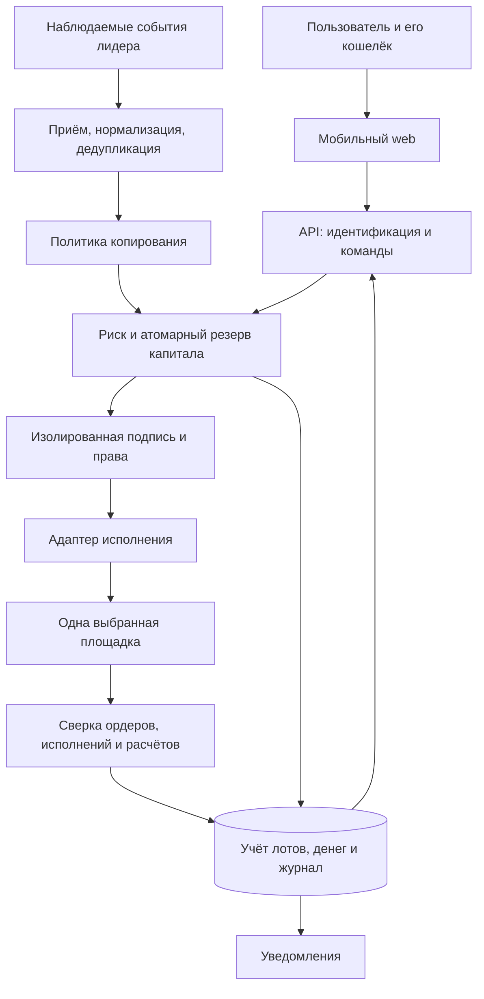

# Пересмотр идеи и архитектуры

Дата: 24 сентября 2026. Статус: первая итерация пересмотра, не утверждённая спецификация.

## Решение основателя

Разработка MVP и интерактивного прототипа приостановлена до согласования идеи и архитектуры. Короткий список географии уточнён основателем: Сомали, Бангладеш, Марокко, Египет и Таиланд. Страна запуска пока не выбрана. По уточнению основателя, клиенты преимущественно используют агентов; первый торговый бюджет оценивается в $10–200. Самостоятельный криптоопыт требует проверки.

Исходный handoff остаётся источником пользовательского опыта. Он подтверждает проблемы основателя, но не масштаб спроса и готовность других пользователей платить. Документы 01–06 и презентация отражают предыдущую гипотезу; при противоречии по очередности работ действует этот пересмотр и PROJECT_STATE.md.

## 1. Что именно мы проверяем

Рабочая идея: сервис помогает человеку выделить ограниченный капитал на копирование выбранного трейдера, понимать фактический результат своей копии и управлять её остатком после ручного вмешательства.

Обещание «защита портфеля» заменить на «контроль правил и ограничений риска». Лимит или остановка не гарантируют предельный убыток: выход зависит от ликвидности, доступности площадки и цены исполнения.

Три самостоятельные гипотезы:

1. Люди регулярно испытывают проблему потери контроля после копирования и готовы менять инструмент ради её решения.
2. Существуют стратегии, результат которых остаётся приемлемым после задержки, ликвидности и всех комиссий копировщика.
3. Пользователь согласен на конкретную модель торговых разрешений и способен отозвать их независимо от нашего интерфейса.

Наличие API, конкурента или прибыльного лидерского кошелька не доказывает эти гипотезы.

## 2. Кого выбирать первым

| Кандидат | Основная задача | Дополнительные требования | Предварительный вывод |
|---|---|---|---|
| Действующий пользователь copy trading | Понять результат и управлять копиями | Перенос привычек, сопоставление с конкурентом | Наиболее близок к наблюдаемой проблеме; основной кандидат для интервью |
| Криптопользователь без опыта prediction markets | Выбрать трейдера и разобраться в риске | Обучение, поиск лидеров, объяснение выплат | Проверять отдельно; нельзя считать тем же сегментом |
| Новичок без кошелька | Пройти весь путь от пополнения до вывода | Восстановление доступа, способы пополнения, поддержка | Существенно иной продукт и стоимость обслуживания |
| Оператор сообщества / партнёр | Дать инструмент своей аудитории | Управление доступом, отчётность, договоры | Отдельная B2B-гипотеза, не добавлять в текущий объём |

Обновление после уточнения канала: наряду с действующими копировщиками исследовать клиентов платёжных агентов. Основатель требует простой вход и реферальную программу; влияние на сегмент, платежи и архитектуру описано в [дополнении 08](08_agent_distribution_and_onboarding.md). География и криптоопыт не следуют из названия Tier‑3.

Выбор рынка: сравнить пять стран из списка основателя после уточнения доступной аудитории и каналов контактов. Для каждой проверить доступность площадки и допустимость услуги, язык, кошельки и пополнение, конкурентов, каналы, предполагаемый баланс и стоимость поддержки. Недопустимый рынок исключается до балльного сравнения. Остальные сравниваются по подтверждённым данным; неизвестное не считать нулём или преимуществом.

### География: сведения основателя от 24.09.2026

| Страна | Подтверждено сообщением основателя | Пока неизвестно |
|---|---|---|
| Сомали | Большой опыт прошлого проекта и контакты | Тип контактов, аудитория, спрос, доступность площадок и допустимость услуги |
| Бангладеш | Большой опыт прошлого проекта и контакты | То же |
| Марокко | Большой опыт прошлого проекта и контакты | То же |
| Египет | Большой опыт прошлого проекта и контакты | То же |
| Таиланд | Есть контакты | Опыт, тип контактов, аудитория, спрос, доступность площадок и допустимость услуги |

Это исходные данные пользователя, а не результаты внешнего исследования. Контакты дают возможность проверять гипотезы через интервью и партнёрские разговоры, но сами по себе не доказывают низкий CAC или наличие покупателей. Не присваивать странам рейтинг до проверки ограничений и качества доступа к целевой аудитории.

Контакты уточнены: агенты MobCash. В нашем проекте они привлекают клиентов по реферальной программе. Приём платежей исключён основателем; интеграция MobCash не планируется. Простой и прозрачный вход проектируется с Polyfox как ориентиром. По сообщению основателя агенты смогут обеспечивать внешний обмен USDT ↔ локальные деньги. Для рефералов согласована база: 25–35% от полученной сервисной комиссии по привлечённым клиентам, без вычета операционных расходов; предусмотреть VIP-условия (документ 08). Проверка выявила ограничения Polymarket для Сомали и Таиланда; см. [дополнение 08](08_agent_distribution_and_onboarding.md).

## 3. Канал и интерфейс

Рекомендуемый основной интерфейс — лёгкий адаптивный сайт с независимой от Telegram учётной записью. Установка PWA необязательна; offline-торговля исключена, устаревшие цены обозначаются явно. Первая версия должна открываться по обычной ссылке на телефоне и компьютере.

Обычный Telegram-бот можно позже подключить для уведомлений. Команда паузы потребует привязки аккаунта, проверки полномочий и аудита. Нельзя делать доставку уведомления условием выполнения торгового действия. Канал привлечения выбирается по аудитории; не предполагать, что Telegram доминирует во всех Tier‑3 странах.

Telegram Mini App не включать в рекомендуемую торговую архитектуру. Официальные blockchain guidelines ограничивают подключение кошельков TON Connect и запрещают ряд non-TON сценариев и внешних ссылок; обычные боты без Mini App освобождены именно от этих правил. Это не общее разрешение на любую торговую деятельность. Сайт во встроенном браузере и официальная Mini App — разные режимы; для кошелька нужен проверенный переход во внешний браузер.

Источник, проверен 24.09.2026: https://core.telegram.org/bots/blockchain-guidelines

## 4. Экономика: что исправить

Обновление 25.09.2026: прежнее решение о стандартных 1% заменено ADR-0005. Принята поэтапная сетка: альфа 0%; первые платные 0,50% taker / 0,25% maker; подтверждённый продукт 0,75% / 0,35%; VIP не выше 1% / 0,50%. Комиссия начисляется только на автоматические fills; ручное и защитное закрытие имеет сервисную ставку 0%. Подписки и performance fee на старте нет.

Определения:

- V — сумма фактически исполненных покупок и продаж за месяц; обе стороны оборота уже включены.
- Выручка = V × ставка сервиса. Повторно удваивать V за вход и выход нельзя.
- Маржинальный доход = выручка − выплаты партнёрам − переменные расходы на данные, исполнение, инфраструктуру и поддержку − возвраты.
- Операционный результат = сумма маржинального дохода − постоянные расходы.
- Срок окупаемости привлечения = CAC / месячный маржинальный доход, только если он положителен. Удержание проверяется по когортам, не задаётся как доказанный срок жизни клиента.

При расчётном составе 62,5% taker и 37,5% maker средняя ставка первых платных пользователей равна 0,40625%, подтверждённого тарифа — 0,60%. Без данных о поддержке и удержании вывод о прибыльности невозможен. Частая торговля не должна искусственно стимулироваться ради комиссии.

P&L считать по фактическим денежным потокам, оценке оставшегося актива и комиссиям. Если фактические цены уже содержат спред и проскальзывание, не вычитать их повторно. Упущенное исполнение и отличие от лидера показывать отдельным сравнением с явно заданным эталоном.

Polymarket документирует builder fee поверх platform fee с ограничениями ставки и возможностью отключения builder code. Это кандидат на механизм взимания, а не гарантированная выручка или подтверждённое право конкретного проекта участвовать.

Источник: https://docs.polymarket.com/programs/builders/fees (24.09.2026).

## 5. Архитектура и границы доверия

Рекомендуемая основа: один модульный backend, отдельный worker и PostgreSQL. Один веб-интерфейс. Логические модули не требуют отдельных микросервисов. Финальный выбор SDK и провайдеров — после проверки возможностей, без фиксации устаревающих адресов контрактов и валюты расчёта в общей модели.

Граница 1: вход на сайт не равен разрешению торговать. Telegram ID не должен быть единственным способом восстановления аккаунта.

Граница 2: право подписи не равно праву вывода. Разрешения, срок, отзыв, тип кошелька и исполнитель подписи описываются отдельно для каждой площадки. Ограничения нашего backend не выдаются за ограничения контракта.

Граница 3: отсутствие права вывода не исключает потери через невыгодную торговлю. Отдельный торговый бюджет ограничивает потенциальный ущерб, но не заменяет проверку подписи и риска.

Граница 4: внешний ордер и его settlement не равны записи в нашем журнале. Хранить состояния принятия, частичного исполнения, окончательного расчёта и неизвестного результата раздельно.

## 6. Проверенные различия площадок

Polymarket: документация описывает beta session keys для Deposit Wallets, торговлю без ключа владельца и отсутствие права вывода у session key. Поддержка Safe/Proxy не должна предполагаться. Кандидат для нашего решения; остаётся проверить срок и отзыв, разрешённые операции, существующие кошельки, хранение session signer и фактически исполняемые ограничения.

Источник: https://docs.polymarket.com/trading/session-keys (24.09.2026).

Limitless: HMAC-токен авторизует API-запрос; для EOA требуется также подпись ордера. Документированный delegated signing использует managed server wallet и партнёрские возможности. Поэтому он не эквивалентен session key пользовательского кошелька. В документации есть несогласованность между пометками self-service в таблице scopes и требованием включения partner capabilities; считать партнёрский доступ неподтверждённым до ответа площадки.

Источники: https://docs.limitless.exchange/developers/authentication и https://docs.limitless.exchange/developers/programmatic-api (24.09.2026).

Этот исходный вывод заменён ADR-0007: Limitless становится первым интеграционным кандидатом благодаря Programmatic API и прямой поддержке, Polymarket — контрольным сравнением и вторым adapter-кандидатом. Обе интеграции одновременно не планируются. Нельзя копировать сделку между площадками только по похожему названию рынка: условия разрешения и ликвидность могут различаться.

## 7. Недостающие решения по торговой логике

До спецификации реализации определить:

- Размер BUY: фиксированный бюджет или доля выделенного капитала; что происходит с остатком после частичного исполнения.
- Размер SELL: пропорция наблюдаемого уменьшения позиции лидера, а не механическое повторение суммы BUY. Неизвестная предыдущая позиция лидера блокирует автоматическое вычисление доли.
- Начало подписки: не копировать старые события автоматически; отдельно решить судьбу уже открытых позиций лидера.
- Ручное закрытие: оставшийся лот продолжает следовать только по явно выбранному правилу; после detach события лидера не возвращают его в автоматику.
- Несколько лидеров: резервирование капитала на весь кошелёк, включая незавершённые ордера; блокировки только по одному рынку недостаточно.
- Пауза: различать запрет новых входов, отмену открытых ордеров, следование выходам и ликвидацию. Не обещать мгновенное закрытие всего.
- Неизвестный результат отправки: сначала выяснить состояние, не повторять ордер вслепую.
- Внешние переводы и ручные сделки: отдельный остаток без атрибуции; не приписывать его лидеру молча.
- Завершение рынка: погашение, выплаты, спорные исходы и корректировки отдельны от SELL.
- Стратегии лидеров: фильтровать маркетмейкинг, арбитраж, слишком короткие сделки и случаи с невидимыми хеджами; доходность адреса не доказывает копируемость.
- Backtest: без исторической книги и времени доступности данных результат только приближение. Запретить look-ahead; не обещать точное воспроизведение исполнения.

## 8. План до начала разработки

1. Продуктовый выбор: сегмент, главная задача, альтернативы и условия отказа от идеи. Результат — новая редакция документа 01.
2. Выбор рынка: короткий список стран, проверяемые источники и канал доступа к первым собеседникам. Отсутствие выбранной страны не препятствует архитектурному анализу, но блокирует утверждение стратегии запуска.
3. Проверка спроса: предложенный ориентир — 8–12 интервью одного сегмента; выяснять последние реальные случаи, текущие расходы и причины смены инструмента. Это качественный тест, не статистическое доказательство рынка. Сообщения людям отправляет основатель; агент без отдельного поручения их не рассылает.
4. Экономика: сценарии оборота, расходов, удержания и цены; отдельно экономика копировщика и сервиса.
5. Архитектура: карта разрешений, данных, исполнения, отказов и учёта; закрыть вопросы раздела 7 на уровне спецификации.
6. Совместный обзор: документы 01 (идея и экономика), 02 (архитектура), 03 (план) согласованы между собой; презентация обновляется по ним.

Условия готовности к разработке: выбран сегмент и рынок запуска; ценность и цена сформулированы как проверяемые гипотезы; выбран осуществимый способ авторизации; определены торговые правила и сценарии отказа; оценены расходы и проверки; основатель явно принимает границы первой реализации. При нехватке доказательств сохраняется статус «не проверено», а не «готово».

Архитектура не может быть полностью доказана документами. Минимальные технические проверки могут понадобиться для отдельных допущений, но в текущей фазе код приложения и реальные ордера не создаются. Необходимость будущей проверки фиксируется вместе с вопросом и критерием успеха; её запуск согласуется как отдельный этап после концепции.

## 9. Текущий вывод

После уточнения агентского канала сравниваются сценарии для опытных копировщиков и клиентов агентов; независимый мобильный web остаётся рекомендуемым интерфейсом. Некастодиальная автоматизация — целевое требование, которое необходимо подтвердить для выбранного типа кошелька. Массовый Tier‑3 запуск, прибыльность и готовность архитектуры не подтверждены.
