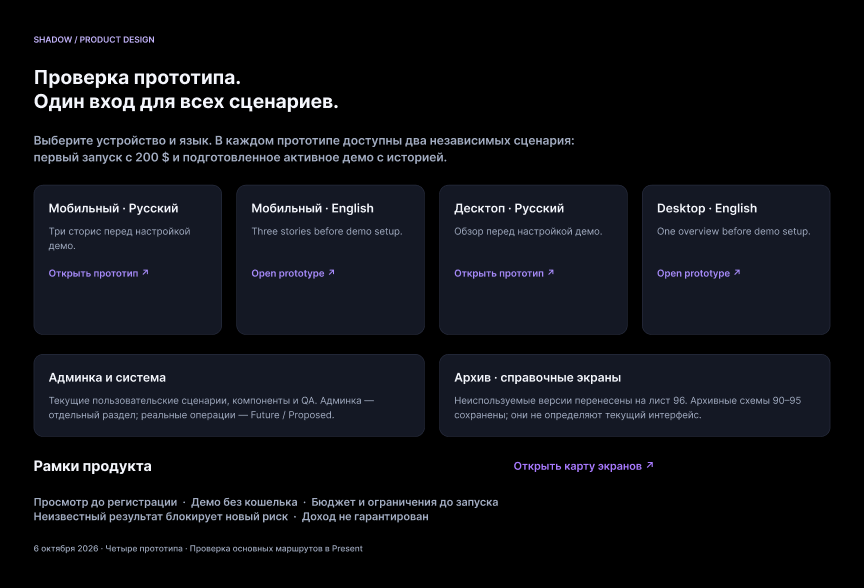

# Четыре прототипа и бизнес-логика · 6 октября 2026

Работа по [плану 105](105_plan_2026-10-06_business_logic_and_four_prototypes.md). Продуктовые правила собраны в [MVP_BUSINESS_LOGIC](MVP_BUSINESS_LOGIC.md): согласованные решения имеют источники ADR, незакрытые BL-05–BL-08 отмечены отдельно. Новые финансовые правила этим циклом не принимались.

## Общий вход и прямые ссылки

[Начать здесь](https://www.figma.com/design/lxPP2um7FvIbt02K8eeH4T?node-id=3-2) содержит четыре ссылки. В каждом прототипе первый экран предлагает два независимых сценария: первый запуск с $200 и подготовленное активное демо с историей. Для смены сценария используйте Restart.

| Версия | Прямой запуск Present | Начальный экран |
|---|---|---|
| Mobile RU | [Открыть](https://www.figma.com/proto/lxPP2um7FvIbt02K8eeH4T?node-id=1839-57824&starting-point-node-id=1839%3A57824&page-id=33%3A2&scaling=scale-down) | 1839:57824 |
| Mobile EN | [Open](https://www.figma.com/proto/lxPP2um7FvIbt02K8eeH4T?node-id=1839-57862&starting-point-node-id=1839%3A57862&page-id=29%3A2&scaling=scale-down) | 1839:57862 |
| Desktop RU | [Открыть](https://www.figma.com/proto/lxPP2um7FvIbt02K8eeH4T?node-id=584-265&starting-point-node-id=584%3A265&page-id=205%3A2&scaling=scale-down) | 584:265 |
| Desktop EN | [Open](https://www.figma.com/proto/lxPP2um7FvIbt02K8eeH4T?node-id=584-225&starting-point-node-id=584%3A225&page-id=186%3A2&scaling=scale-down) | 584:225 |

## Проверка в Present

Статус: основные маршруты первого запуска и подготовленного активного демо пройдены в Present на всех четырёх версиях. Найденные разрывы исправлены и повторно проверены. Визуальное утверждение всего файла владельцем остаётся отдельной приёмкой.

Проверка выполнялась вручную в Present через браузер. Проверка структуры реакций агентами дополняет ручной проход и не заменяет его. Сведения об экранах и исправленных реакциях: [mobile-аудит](../design/qa-2026-10-06/mobile-route-audit.md), [desktop-аудит](../design/qa-2026-10-06/desktop-route-audit.md).

| Версия | Проверенный первый маршрут | Подготовленное демо |
|---|---|---|
| Mobile RU | Вход → три сторис → каталог → профиль → фиксированная сумма/3% → проверка и пример email-входа → запуск → свежая сессия 949:4398; пустые позиции → Главная сохраняют новую сессию | Главная 888:1701 → каталог/профиль, позиции, заявки, события, средства, профиль, отчёт, история, рынки и помощь |
| Mobile EN | Вход → три сторис → каталог → профиль → сумма/3% → проверка и пример email-входа → запуск → свежая сессия 949:9307; пустые позиции → Home сохраняют новую сессию | Главная 905:1754 → каталог, позиции, заявки, события, средства, профиль, отчёт, история, рынки и помощь |
| Desktop RU | Вход → обзор → каталог → профиль → настройки → фиксированная и процентная проверка → пример email-входа → новая сессия 949:13177; позиции, заявки и события пустые; позиции → Главная сохраняют новую сессию | Главная 905:9074 → каталог/профиль, позиции, заявки, события, средства, профиль, отчёт, история, рынки и помощь |
| Desktop EN | Вход → обзор → каталог → профиль → сумма/3% → проверка → пример email-входа → новая сессия 949:16981; пустые позиции → Home сохраняют новую сессию | Главная 905:9713 → каталог, позиции, заявки, события 905:9845, средства 905:9867, профиль → отчёт 1753:7561 → возврат, история 1753:7649, рынки 1753:7689 и помощь |

Дополнительно в mobile EN пройдены «Итог уточняется» → детали 905:8733 → возврат и учебное частичное исполнение 1740:16754 → возврат в заявки. При неизвестном итоге повторная отправка недоступна, резерв сохранён. Учебный пример показывает $8 исполнено/$12 ожидает подтверждения отмены; это отдельный сценарий, а не операция подготовленного счёта.

Ветка email повторно пройдена вручную: mobile RU — 3% (1853:38217 → 1853:38238 → 1839:56218 → 949:4398); mobile EN — фиксированные $20 (1853:38027 → 1853:38048 → 949:9225 → 949:9307); desktop RU — фиксированные $20 (1854:8894 → 1854:9409 → 949:13097 → 949:13177); desktop EN — 3% (1853:7369 → 1853:7868 → 1709:6972 → 949:16981). После подтверждения размер копии сохранён, запуск требует отдельного действия. Возврат без подтверждения проверен в mobile EN и desktop EN; он сохраняет настройки и не запускает сессию. Пример не отправляет письма и не создаёт настоящий аккаунт.

## Что исправлено

- Первый запуск больше не открывает каталог с балансом $180.38, шестью уведомлениями и уже существующими копиями. Выделен сценарий Momentum Fox с $200 и пустой собственной историей.
- Возвраты из пустых экранов сохраняют новую сессию. В desktop EN/RU повторно пройдены Positions → Home после исправления видимых акторов навигации; меню новой сессии выровнено сверху. Подготовленная история открывается отдельным действием.
- Гость проходит пример обязательного email-входа перед запуском. Возврат после подтверждения сохраняет фиксированную сумму или процент; активное демо считается подготовленным аккаунтом.
- Название выделенного бюджета уточнено: «Демо-бюджет» / «Demo budget».
- Учебный пример частичного исполнения исключён из подсчёта заявок: на счёте 41 заявка. Ссылка на пример явно подписана.
- В desktop EN исправлены переходы из активного демо в события и средства; в профиль добавлены входы в отчёт, историю копирования и рынки.
- Мобильная кнопка About demo помещается в одну строку. Пустые контейнеры в выделенном каталоге и профиле убраны.
- Стартовый лист содержит четыре общих входа вместо восьми разрозненных ссылок. Старые экраны сохранены как история работы.

## Проверки документов

`npm run check` и `git diff --check` проходят. Проверки подтверждают структуру проекта и локальные ссылки; работоспособность прототипа подтверждена отдельно ручными проходами выше.

## Границы передачи

Это кликабельные интерфейсные сценарии. Произвольный ввод, настоящая отправка email, постоянное хранение и расчёт исполнения здесь не реализованы. Подготовленная история — демонстрационные данные. Первый маршрут ограничен Momentum Fox; desktop показывает его 30-дневный профиль, полный каталог остаётся в активном сценарии.

Прохождение этих маршрутов не означает визуального утверждения всего Figma-файла, всех редких веток или разрешения frontend/API/live. Открытые продуктовые вопросы и их последствия перечислены в разделе 12 [единого файла](MVP_BUSINESS_LOGIC.md).

