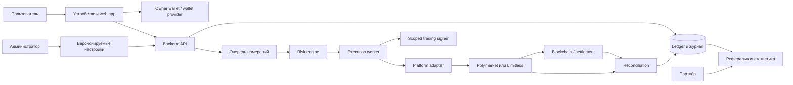

# Границы доверия, полномочия и торговые состояния

Дата: 24.09.2026. Статус: предлагаемая спецификация для будущих spike-проверок. Код и реальные сделки не создаются.

## 1. Цель

Документ отвечает на четыре вопроса:

1. Кто контролирует средства и ключи?
2. Какие действия разрешены каждому компоненту?
3. В каких состояниях находятся событие, намерение, ордер, исполнение и виртуальный лот?
4. При каких неопределённостях автоматика обязана остановиться?

## 2. Границы доверия

### Зона пользователя

Пользователь контролирует owner wallet, восстановление, экспорт, вывод и выдачу/отзыв торгового разрешения. Web app не получает seed phrase или основной приватный ключ.

### Зона wallet-провайдера

Провайдер может участвовать в создании, хранении долей, восстановлении и экспорте встроенного кошелька. Его модель контроля должна проверяться отдельно; красивый onboarding не является доказательством пользовательского владения.

### Зона нашего backend

Backend хранит настройки, политики копирования, журнал, ledger и ссылки на кошельки. Он создаёт намерения и решения риска, но не должен иметь возможности вывести средства или восстановить owner key.

### Зона execution worker

Worker — единственный сервисный компонент, который может использовать scoped trading signer. Доступ ограничен конкретным пользователем, площадкой и разрешённым набором операций. Произвольный RPC/подпись из административного интерфейса запрещены.

### Зона площадки и blockchain

Площадка является источником истины по ордерам и fills в пределах её API. Blockchain является источником истины по владению токенами и settlement. Ни один источник отдельно не объясняет происхождение позиции; это задача внутреннего ledger.

### Зона администратора

Администратор может менять версионируемые комиссии, партнёрские условия, allowlist и аварийные выключатели. Он не получает owner key, session signer и право ручной торговли за пользователя.

### Зона партнёра

Партнёр видит только агрегированную реферальную статистику и собственные начисления. Он не видит ключи, полный баланс, историю чужих клиентов или команды управления торговлей.

## 3. Матрица полномочий

| Действие | Пользователь / owner signer | Trading signer | Backend / worker | Администратор | Партнёр |
|---|---:|---:|---:|---:|---:|
| Создать/подключить owner wallet | Да | Нет | Только orchestration | Нет | Нет |
| Восстановить или экспортировать owner wallet | Да | Нет | Нет | Нет | Нет |
| Пополнить и вывести средства | Да | Нет | Нет | Нет | Нет |
| Выдать торговое разрешение | Да | Нет | Подготавливает запрос | Нет | Нет |
| Отозвать торговое разрешение | Да | Нет | Может инициировать по команде пользователя/kill switch | Может включить общий kill switch | Нет |
| Создать copy policy | Подтверждает | Нет | Хранит и исполняет | Нет | Нет |
| Рассчитать размер и риск | Видит результат | Нет | Да | Настраивает допустимые системные пределы | Нет |
| Подписать разрешённый торговый ордер | Нет для автоматического режима | Да | Только через scoped signer | Нет | Нет |
| Отправить/отменить ордер | Команда через UI | Да | Да, после risk gate | Только общий stop, без ручной торговли | Нет |
| Изменить комиссию сервиса | Нет | Нет | Применяет активную версию | Да, с журналом и датой вступления | Нет |
| Изменить партнёрские условия | Нет | Нет | Применяет активную версию | Да, с журналом | Нет |
| Просмотреть персональные торговые данные | Свои | Только технически необходимые | Минимально необходимые | Только роль поддержки с аудитом | Нет |
| Просмотреть реферальные начисления | Нет | Нет | Рассчитывает | Поддержка/финансы | Только свои агрегаты |

Право, которое не указано явно, считается запрещённым.

## 4. Состояния исходного события лидера

| Состояние | Значение | Разрешённый переход |
|---|---|---|
| `RECEIVED` | Сырой payload сохранён | `VALIDATED`, `DUPLICATE`, `UNSUPPORTED` |
| `VALIDATED` | Формат и источник подтверждены | `ELIGIBLE`, `STALE`, `UNSUPPORTED` |
| `DUPLICATE` | Стабильный ключ уже обработан | Финальное |
| `UNSUPPORTED` | Действие нельзя безопасно копировать | Финальное с причиной |
| `STALE` | Событие старше допустимой задержки | Финальное с причиной |
| `ELIGIBLE` | Можно создать пользовательские intents | Финальное для ingestion; дальнейший процесс идёт по каждому intent |

Событие не изменяется после классификации. Исправление источника создаёт новую версию нормализации с явной связью, а не переписывает историю.

## 5. Состояния CopyIntent

| Состояние | Значение | Разрешённый переход |
|---|---|---|
| `CREATED` | Намерение создано идемпотентно | `RISK_CHECKING`, `ABORTED` |
| `RISK_CHECKING` | Получается актуальный снимок риска и книги | `READY`, `REJECTED`, `ABORTED` |
| `REJECTED` | Risk engine запретил действие | Финальное с кодом причины |
| `READY` | Размер, цена и срок действия зафиксированы | `SUBMITTING`, `EXPIRED`, `ABORTED` |
| `SUBMITTING` | Начался единственный сетевой вызов | `ORDER_LINKED`, `SUBMISSION_UNKNOWN`, `FAILED` |
| `SUBMISSION_UNKNOWN` | Результат вызова неизвестен | `ORDER_LINKED`, `FAILED_AFTER_RECONCILIATION` |
| `ORDER_LINKED` | Найден platform order id | Финальное для intent |
| `EXPIRED` | Истёк срок допустимой цены/задержки | Финальное |
| `ABORTED` | Stop/revoke до отправки | Финальное |
| `FAILED` | Площадка достоверно отказала | Финальное |

`SUBMISSION_UNKNOWN` блокирует повторную отправку. Сначала выполняется поиск по client id, signer, market и временному окну.

## 6. Состояния ордера

| Состояние | Значение | Разрешённый переход |
|---|---|---|
| `PENDING_ACK` | Отправлен, подтверждение площадки ожидается | `OPEN`, `PARTIALLY_FILLED`, `FILLED`, `REJECTED`, `UNKNOWN` |
| `OPEN` | Принят, исполнений нет | `PARTIALLY_FILLED`, `FILLED`, `CANCEL_REQUESTED`, `EXPIRED`, `UNKNOWN` |
| `PARTIALLY_FILLED` | Есть fills и открытый остаток | `FILLED`, `CANCEL_REQUESTED`, `CANCELLED`, `EXPIRED`, `UNKNOWN` |
| `CANCEL_REQUESTED` | Отмена отправлена, результат ещё не подтверждён | `CANCELLED`, `PARTIALLY_FILLED`, `FILLED`, `UNKNOWN` |
| `CANCELLED` | Остаток достоверно отменён | Финальное; fills сохраняются |
| `FILLED` | Весь допустимый объём исполнен | Финальное |
| `REJECTED` | Площадка достоверно отказала | Финальное |
| `EXPIRED` | Площадка завершила ордер по сроку | Финальное; fills сохраняются |
| `UNKNOWN` | Текущее состояние не доказано | Только reconciliation; новые конфликтующие действия блокируются |

Fill — неизменяемый факт. Исправление создаётся корректирующей записью и reconciliation issue.

## 7. Состояния виртуального лота

| Состояние | Значение | Поведение следующих событий лидера |
|---|---|---|
| `FOLLOWING` | Лот полностью следует лидеру | Buy/Sell обрабатываются по политике |
| `PARTIALLY_OVERRIDDEN` | Пользователь вручную изменил часть | Автоматика действует только на явно оставшийся follow-объём |
| `DETACHED` | Пользователь отсоединил лот | Все будущие события лидера игнорируются |
| `CLOSING` | Закрытие отправлено, итог не подтверждён | Новые конфликтующие действия блокируются |
| `CLOSED` | Остаток лота равен нулю | Финальное |
| `RECONCILIATION_BLOCKED` | Ledger нельзя согласовать с внешним состоянием | Любая автоматическая продажа/докупка по лоту запрещена |

Ручная продажа общего outcome token не распределяется молча. Пользователь заранее выбирает затрагиваемые лоты либо система применяет утверждённое прозрачное правило и показывает результат до подтверждения.

## 8. Состояния ReconciliationIssue

| Состояние | Значение |
|---|---|
| `OPEN` | Расхождение обнаружено |
| `BLOCKING` | Может привести к неверной торговле; связанная автоматика остановлена |
| `INVESTIGATING` | Собираются platform/on-chain/ledger доказательства |
| `CORRECTION_PROPOSED` | Подготовлена явная корректирующая запись |
| `RESOLVED` | Источники согласованы, причина и действия записаны |
| `ACCEPTED_VARIANCE` | Расхождение объяснено допустимым правилом и не переписывает факты |

Закрытие issue требует причины, доказательств и ссылки на корректировки. Удаление issue запрещено.

## 9. Денежные и торговые инварианты

1. Суммарное количество открытых отслеживаемых лотов по outcome не превышает подтверждённый доступный баланс пользователя.
2. Автоматический sell не превышает остаток конкретных лотов, связанных с событием лидера.
3. Лот меняется только по подтверждённому fill или явной корректирующей записи.
4. Повтор одного source event не создаёт второй CopyIntent для той же policy.
5. Повтор сетевого ответа или webhook не создаёт второй fill.
6. Неизвестный результат отправки блокирует retry до reconciliation.
7. Комиссия рассчитывается по каждому фактическому fill с сохранением применённой версии ставки.
8. Партнёрское начисление рассчитывается только от фактически полученной сервисной комиссии.
9. Изменение комиссии или партнёрской версии не пересчитывает историю.
10. Отзыв trading signer запрещает новые отправки немедленно; открытые ордера считаются активными, пока отмена не подтверждена.
11. Kill switch запрещает новые intents и submissions, но не скрывает уже начатые операции и reconciliation.
12. Отсутствие свежей книги, platform status или reconciliation freshness переводит действие в reject/hold, а не в optimistic execution.
13. Дневной лимит новых покупок учитывает подтверждённые risk-increasing fills и резервирует незавершённые покупки; sell и безопасное сокращение позиции им не блокируются.
14. Бюджет трейдера включает открытые виртуальные лоты, незавершённые покупки, резерв комиссии и операции с неизвестным состоянием.
15. Резервирование дневного лимита и бюджета трейдера выполняется атомарно до отправки ордера.
16. Устаревшая risk-increasing покупка не создаёт ордер. Устаревшее событие закрытия переводится в проверку актуального состояния и reconciliation, а не отбрасывается молча.

## 10. Kill switches

| Уровень | Что останавливает | Кто включает |
|---|---|---|
| Глобальный | Все новые intents и submissions | Уполномоченный администратор |
| Площадка | Новые операции конкретного adapter | Система или администратор |
| Пользователь | Всю автоматику пользователя | Пользователь; система при security/reconciliation incident |
| Кошелёк | Операции signer/wallet | Пользователь; security automation |
| Лидер | Новые intents по лидеру | Пользователь; risk automation |
| Рынок | Новые и конфликтующие действия в market | Risk/reconciliation automation |
| Лот | Действия конкретного virtual lot | Пользователь; reconciliation automation |

Снятие автоматического stop не возобновляет старые intents. Новые события обрабатываются только после явного восстановления режима.

## 11. Дополнительные risk gates

### Дневной лимит новых покупок

Политика хранит сумму, часовой пояс пользователя и правило уменьшения последней сделки. Граница начавшегося пользовательского дня фиксируется в UTC. Использование равно исполненным risk-increasing покупкам плюс резерв открытых и неизвестных buy-операций. При недостатке остатка размер уменьшается только при прохождении minimum size; иначе intent получает отказ с причиной.

### Бюджет на трейдера

Свободный бюджет вычисляется из установленного лимита за вычетом открытой экспозиции, резервов комиссии, незавершённых и неизвестных покупок. Подтверждённый sell освобождает бюджет. Detached-лот продолжает занимать бюджет, пока риск фактически открыт или пользователь явно не изменил область политики.

### Допустимый возраст события

Для увеличивающей риск покупки `source timestamp` сравнивается со временем начала обработки. Превышение настраиваемого порога создаёт `STALE` и запрещает ордер. Порог версионируется по площадке и источнику после измерения задержки. События сокращения позиции проходят актуальную сверку и не блокируются механически тем же правилом.

### Важность уведомлений

Обычные исполнения можно объединять в дневную сводку. Пропуски, крупные отклонения и крупные сделки отправляются согласно выбору пользователя. Stop, отзыв разрешения, `UNKNOWN`, блокирующий `ReconciliationIssue`, нарушение риска, недоступность площадки и неподтверждённое движение средств всегда создают немедленное критическое уведомление. Отключить их полностью нельзя.

## 12. Gate для дизайна

До wireframes дизайн может использовать эту спецификацию для обязательных состояний интерфейса:

- разрешение выдано / отсутствует / истекает / отозвано;
- сделка скопирована / отклонена / просрочена / неизвестна;
- ордер открыт / частично исполнен / отменяется / заблокирован сверкой;
- лот следует / частично изменён / отсоединён / закрывается / закрыт;
- глобальная, пользовательская и локальная остановка;
- использовано / зарезервировано / свободно по дневному лимиту и бюджету трейдера;
- режим уведомлений и обязательные критические события;
- понятная причина и рекомендуемое действие для каждого состояния.

Визуальное решение и тексты ошибок остаются задачей UX-чата.
