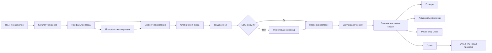
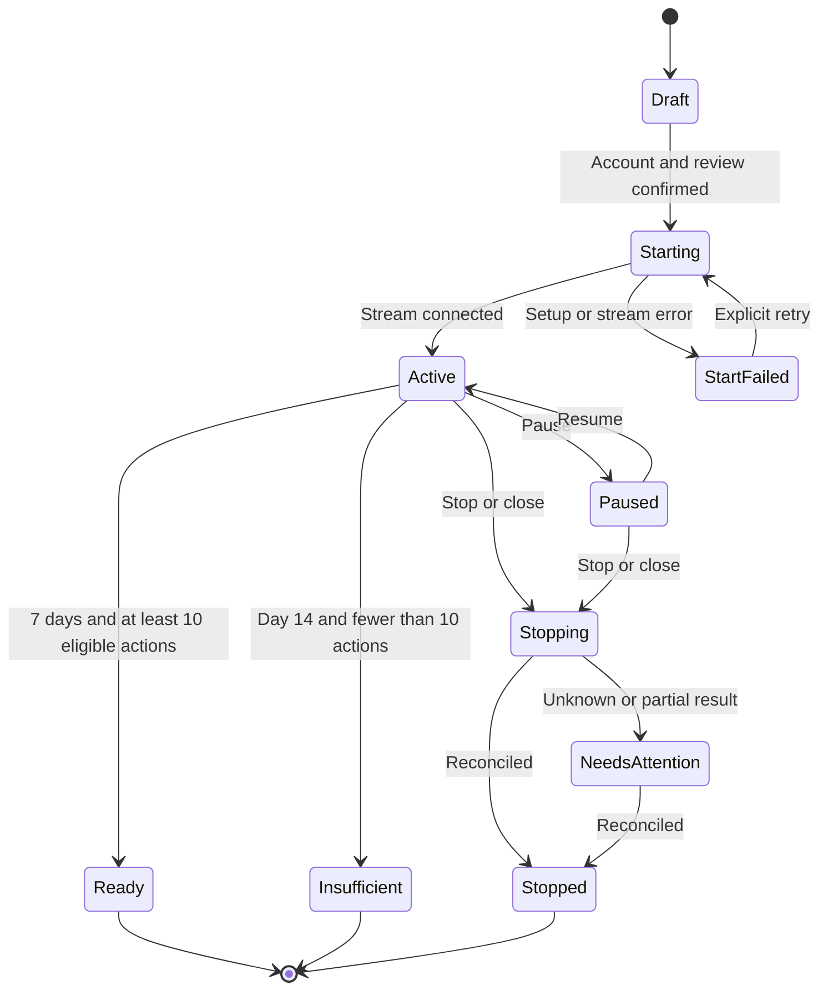

# Каноническая карта экранов и состояний

Уточнение 02.10.2026: [ADR-0013](decisions/0013_consolidated_ux_and_risk_boundaries.md) и [план 55](55_consolidated_product_plan_2026-10-02.md) имеют приоритет в изменённых правилах. При первом входе показать демо, прохождение необязательно; будущая реальная ветка имеет отдельные gates. Мониторинг предлагает ручные действия, финансовые пороги ещё не утверждены.

Дата: 29.09.2026. Статус: продуктовая спецификация mobile и desktop для shadow/paper MVP. Заменяет прежнюю сокращённую карту этого файла. Основание: ADR-0009, ADR-0010 и ADR-0011.

## 1. Назначение и границы

Этот документ — единый источник правды для состава экранов, переходов, состояний и адаптации mobile/desktop. Стартовые параметры приняты в [ADR-0012](decisions/0012_paper_mvp_defaults.md). Точные тексты берутся из [документа 35](35_bilingual_low_fidelity_flow.md) и каталога локализации; обязательные правила построения и проверки — из [стандарта интерфейса и frontend](41_product_design_and_frontend_standards.md), а история выявленных дефектов — из [аудита качества](39_design_quality_audit.md).

Первый выпуск:

- самостоятельное web-приложение для совершеннолетнего пользователя без опыта prediction markets;
- просмотр трейдеров и исторической симуляции без регистрации;
- полноценная shadow/paper-сессия без реальных денег;
- English и Русский с одной информационной архитектурой;
- Polymarket и Limitless как источники данных с одинаковой продуктовой моделью;
- in-app уведомления обязательны, Telegram подключается по желанию;
- mobile-first, но desktop является полноценным сценарием, а не растянутым мобильным экраном.

Paper MVP технически не создаёт реальные ордера, не принимает депозит и не выводит деньги. Поэтому экран кошелька первого выпуска управляет **виртуальным балансом**. Архитектура будущего live-пополнения описана отдельно в разделе 12, чтобы не маскировать перевод реальных средств под paper-действие.

## 2. Что пользователь должен понимать на каждом экране

Каждый рабочий экран отвечает на шесть вопросов:

1. Где я нахожусь и какой режим активен: `Paper — no real money` / `Демо — без реальных денег`.
2. Что система сейчас делает или ждёт.
3. Какая сумма доступна, выделена, зарезервирована или находится в позициях.
4. Какое ограничение сработало и почему.
5. Что произойдёт после основного действия.
6. Что можно сделать дальше без увеличения риска.

Технический код состояния не используется как единственное объяснение. Относительное время дополняется абсолютным временем и часовым поясом в деталях. Доходность, P&L и рейтинг всегда имеют период и базу расчёта.

## 3. Информационная архитектура и навигация

Основные пользовательские разделы после входа:

- `Home / Главная` — баланс, активные сессии и требующие внимания события;
- `Traders / Трейдеры` — поиск, рейтинг, профиль и историческая симуляция;
- `Activity / Активность` — позиции, исполнения, пропуски и причины;
- `Profile / Профиль` — язык, уведомления, помощь и обратная связь.

На mobile это нижняя навигация с четырьмя пунктами. На desktop — постоянная боковая навигация. Название текущего раздела, переключатель языка и центр уведомлений доступны без потери контекста.

Вложенный поток настройки не показывает основную навигацию как конкурирующее действие. На mobile он использует явный возврат и нижнюю закреплённую CTA-зону; на desktop — основной контент слева и закреплённую сводку настройки справа.

## 4. Сквозной пользовательский поток

До регистрации доступны знакомство, каталог, ручной поиск, профиль, историческая симуляция и черновик настройки. Возврат назад сохраняет черновик на устройстве. Регистрация требуется для запуска и сохранения shadow-сессии.

## 5. Инвентарь пользовательских экранов

### 5.1 Знакомство и выбор трейдера

| ID | Экран | Обязательное содержание | Основное действие |
|---|---|---|---|
| U01 | Язык и локаль | English, Русский; продолжение на текущей локали | выбрать язык |
| U02 | Знакомство | что копируется; различие historical simulation и shadow; отсутствие реальных денег; возможность убытка в live | посмотреть трейдеров |
| U03 | Каталог трейдеров | качество копирования `/100`, период, площадка, результат после расчётных расходов, просадка, копируемость, бюджет от; фильтры и сортировка | открыть трейдера |
| U04 | Поиск по адресу | выбор площадки, ввод адреса, проверка формата, найден/не найден/недостаточно данных | открыть профиль |
| U05 | Профиль трейдера | методика рейтинга, P&L и просадка по периодам, копируемость, число подходящих действий, рынки, свежесть данных | историческая симуляция или настройка |
| U06 | Историческая симуляция | исходный бюджет; 30 дней по умолчанию, 7/90 при достаточных данных; результат трейдера и пользователя, пропуски, виртуальные расходы, оговорка о прошлых данных | использовать настройки как черновик |

### 5.2 Настройка копирования

| ID | Экран | Обязательное содержание | Основное действие |
|---|---|---|---|
| U07 | Бюджет | $200 по умолчанию; точный ввод и пресеты; доступный виртуальный баланс; минимально разумный бюджет; proportional sizing | продолжить |
| U08 | Ограничения | default: позиция 10% бюджета, новые покупки за день 15%, сигнал 30 секунд; общий бюджет трейдера; значение и единица у каждого контрола | продолжить |
| U09 | Уведомления | in-app всегда; Telegram опционально; все события, только важные, крупные, сводка: недельная по умолчанию или дневная | продолжить |
| U10 | Регистрация или вход | email с одноразовой ссылкой или кодом; зачем нужен аккаунт; сохранение черновика; восстановление без пароля | создать аккаунт или войти |
| U11 | Проверка настроек | трейдер, площадка, paper-режим, бюджет, все лимиты, уведомления, фактическая комиссия 0%, пример будущей виртуальной комиссии | запустить shadow |
| U12 | Запуск | последовательность `сохраняем → подключаем поток → готово`; безопасный выход; ошибка не создаёт дубль сессии | открыть сессию |

На desktop U07–U11 используют закреплённую справа `Copy setup summary`: трейдер, площадка, paper/live, бюджет, лимиты, виртуальные расходы и последствия CTA. На mobile эта сводка открывается перед запуском как полноэкранный review или bottom sheet, но критический текст не прячется в свёрнутом состоянии.

### 5.3 Главная, виртуальный кошелёк и сессия

| ID | Экран | Обязательное содержание | Основное действие |
|---|---|---|---|
| U13 | Главная | общий виртуальный баланс, доступно, выделено, зарезервировано, в позициях; активные сессии; P&L за период; важный статус | открыть сессию или трейдеров |
| U14 | Paper balance | начальный и текущий виртуальный баланс, распределение, история изменений, явная маркировка симуляции | добавить тестовые средства или сбросить demo |
| U15 | Изменение paper-баланса | сумма, влияние на сравнимость отчёта, подтверждение сброса; отсутствие реального перевода | подтвердить виртуальное действие |
| U16 | Активная shadow-сессия | прогресс 7 дней и 10 действий, дни до максимума 14, свежесть данных, бюджет и лимиты, открытые позиции, P&L после виртуальных расходов, последнее событие | позиции, активность или управление |
| U17 | Позиции | открытые/закрытые; рынок, сторона, размер, средняя и текущая цена, P&L, источник, статус | открыть позицию |
| U18 | Деталь позиции | таймлайн копирования, исполнения и расходов; связанный лидерский сигнал; ручное paper-закрытие и его последствия | закрыть в симуляции или вернуться |
| U19 | Активность | все/важные/пропуски; `copied`, `partial`, `skipped`, `pending`, `unknown`, `closed`; причина и время | открыть событие |
| U20 | Деталь события | сигнал, проверенные ограничения, расчёт размера, цена/ликвидность, исполненная и пропущенная части, виртуальные расходы, понятная причина; для уже начатого частичного исполнения — запрошенная сумма, подтверждённая часть, остаток, статус отмены и резерв до сверки по ADR-0026 | помощь или связанная позиция |
| U21 | Центр уведомлений | непрочитанные и история; категория, время, сессия, безопасное действие; настройки канала | открыть контекст события |
| U22 | Управление сессией | Pause, Resume, отключить и оставить, закрыть и отключить; текущие позиции и незавершённые действия | подтвердить выбранное действие |
| U23 | Подтверждение управления | точные последствия, что продолжит работать, что остановится, число затронутых позиций | подтвердить или отменить |
| U24 | Результат shadow | начальный/итоговый баланс, P&L после виртуальных расходов, просадка, скопировано/частично/пропущено, причины, достаточность данных | отзыв или новая проверка |

`Paper balance` — аналог кошелька первого выпуска. Кнопки используют формулировки `Add test funds / Добавить тестовые средства`, а не `Deposit / Пополнить`, чтобы не создавать впечатление реального перевода.

### 5.4 Профиль, настройки и помощь

| ID | Экран | Обязательное содержание | Основное действие |
|---|---|---|---|
| U25 | Профиль и настройки | язык, часовой пояс дневного лимита, режим уведомлений, Telegram, безопасность аккаунта | сохранить |
| U26 | Подключение Telegram | что отправляется, переход к подключению, успех/ошибка/отключено | подключить или отключить |
| U27 | Помощь и объяснения | paper vs live, рейтинг, P&L, расходы, состояния сделки, Pause/Stop/Close | открыть тему или поддержку |
| U28 | Feedback | понятность настройки 1–5, причина остановки/отказа, свободный текст, контекст экрана без секретов | отправить |

## 6. Mobile и desktop: одинаковая логика, разная композиция

| Зона | Mobile, 320–430 px | Desktop, 1280–1440 px |
|---|---|---|
| Навигация | нижняя панель; вложенные экраны с back | боковая панель; breadcrumbs только на глубине |
| Каталог | одна колонка, фильтры в sheet | список/карточки плюс фильтры в боковой панели |
| Профиль трейдера | последовательные секции | основные показатели и график слева, сводка/CTA справа |
| Настройка | один смысловой шаг на экран | stepper слева, постоянная `Copy setup summary` справа |
| Главная | вертикальный приоритет: статус → деньги → сессии → события | сводка сверху, сессии и события в двух колонках |
| Сессия | summary, позиции и события вкладками/секциями | summary и управление сверху, позиции и события одновременно ниже |
| Таблицы | карточки с раскрытием деталей | таблица с фиксированными ключевыми колонками и detail drawer |
| Критическое подтверждение | full-screen dialog или bottom sheet с видимыми действиями | modal с фокусом и краткой сводкой затронутых данных |

Desktop не уменьшает число шагов подтверждения рискованных действий. Hover дополняет, но не заменяет видимый текст, focus и click. На ширине 1024 px допускается компактная боковая навигация; ниже 768 px применяется mobile-композиция.

## 7. Денежная модель paper-интерфейса

Виртуальный баланс имеет взаимоисключающие категории:

`Total = Available + Allocated but unused + Reserved in pending actions + Open positions at accounting basis`

Отдельно показываются текущая оценка открытых позиций и нереализованный P&L; они не смешиваются с доступным остатком. Все суммы маркируются `Paper` и используют одну расчётную валюту MVP. Неизвестная цена не превращается в ноль.

Изменение тестового баланса:

- не является депозитом;
- создаёт запись в paper-ledger;
- во время активной сессии предупреждает, что сравнимость отчёта изменится;
- сброс с открытыми позициями требует сначала завершить или явно сбросить сессию;
- не имитирует сетевую транзакцию, подтверждение блокчейна или одобрение площадки.

## 8. Состояния сессии, сигнала и позиции

### 8.1 Shadow-сессия

`Ready` означает достаточность отчёта, а не успешность стратегии. Досрочно завершённый отчёт получает статус `Stopped by user / Остановлено пользователем` и не получает итоговую оценку качества.

### 8.2 Сигнал и виртуальное исполнение

`Received → Risk checks → Sized → Submitted to simulator → Pending → Partially filled → Filled / Skipped / Cancelled / Rejected / Unknown → Reconciled`

Правила:

- `Skipped` означает осознанное решение системы до создания виртуального исполнения и всегда имеет reason code;
- `Partial` показывает исполненную и оставшуюся части отдельно;
- `Unknown` останавливает новые действия, увеличивающие риск, до сверки;
- повтор не создаётся автоматически, если исход неизвестен;
- бумажное исполнение не называется подтверждённым Polymarket или Limitless;
- изменение лидером позиции связывается с исходным событием, а не показывается новой несвязанной сделкой.

### 8.3 Позиция

`Opening → Open → Increasing / Reducing → Closing → Partially closed → Closed`.

Дополнительные состояния: `Close-only`, `Price unavailable`, `Settlement pending`, `Settled`, `Needs attention`. Ручное paper-закрытие блокирует автоматический повторный вход по тому же сигналу на согласованный период или до явного разрешения пользователя.

## 9. Обязательные варианты и восстановление

| Состояние | Что обязательно показать | Разрешённые действия |
|---|---|---|
| Loading | skeleton структуры, название загружаемого блока | back и безопасная навигация |
| First-use empty | почему данных ещё нет и какой первый шаг | перейти к трейдерам |
| Filtered empty | активные фильтры и способ их изменить | сбросить фильтры |
| Offline | какие данные сохранены и когда обновлялись | повторить загрузку, просмотр cached data |
| Stale data | время последнего обновления и допустимый порог | просмотр; рискованные действия блокируются после порога |
| Venue unavailable | площадка, затронутые сессии и известное время начала | просмотр, Pause, Stop, запрос Close |
| Trader not found | проверенный адрес и площадка | исправить или сменить площадку |
| Insufficient trader data | чего не хватает для `/100` и основного рейтинга | просмотр; ручной запуск с объяснением, если разрешён |
| Invalid amount | правило, введённое значение и допустимый диапазон | исправить |
| Insufficient paper balance | доступно, требуется и где изменить тестовый баланс | уменьшить бюджет или добавить test funds |
| Daily limit reached | использовано/лимит и время сброса с часовым поясом | выходы и снижение риска |
| Trader budget reached | занято/лимит и открытые позиции | уменьшение или закрытие |
| Signal too old | фактическая задержка и установленный предел | просмотр; покупка пропущена |
| Insufficient liquidity | запрошенная, исполнимая и пропущенная суммы | изменить будущий лимит; без blind retry |
| Pending | что ожидается и с какого времени | просмотр, допустимая отмена незавершённой части |
| Partially copied | исполненная и пропущенная/ожидающая части | детали |
| Status unknown | что не подтверждено и какие действия остановлены | Pause/Stop, поддержка; без Retry order |
| Closing | запрос закрытия и оставшийся риск | отслеживать |
| Partially closed | закрытая и открытая части | повторная оценка после сверки |
| Close failed | причина, оставшаяся позиция и следующий безопасный шаг | повторная проверка, поддержка |
| Session start failed | сохранённый черновик и отсутствие дубля | явный retry или редактирование |
| Auth expired | что сохранено и что требует входа | войти без потери черновика |
| Telegram unavailable | in-app продолжает работать | повторить позже или отключить Telegram |
| Not enough shadow data | срок, число событий и ограничение вывода | продолжить до 14 дней или завершить без оценки |
| Generic error | понятное действие, reference ID и сохранность данных | повторить безопасную операцию или обратиться в поддержку |

Ошибка не должна очищать заполненную форму, скрывать оставшийся риск или показывать успешное состояние до подтверждения внутренним ledger.

## 10. Pause, Stop и Close

| Действие | Новые покупки | Увеличение | Выходы лидера | Открытые позиции | Возобновление |
|---|---|---|---|---|---|
| Pause | нет | нет | да | продолжают отслеживаться | да |
| Отключить и оставить | нет | нет | нет | ручное управление и системные защиты | новая настройка |
| Закрыть и отключить | нет | нет | запрос закрытия | видимы до подтверждения | после сверки — новая настройка |

Перед подтверждением U23 показывает число позиций, незавершённых действий, приблизительную стоимость при известных данных и конкретные последствия. Сервисная комиссия ручного или защитного закрытия равна 0%; прочие известные виртуальные расходы показываются отдельно.

## 11. Уведомления

| Приоритет | Примеры | Канал по умолчанию | Поведение |
|---|---|---|---|
| Critical | unknown, close failed, потеря потока данных, действие пользователя необходимо | in-app сразу; Telegram при подключении | не объединять в обычную сводку |
| Important | partial, лимит достигнут, сессия paused/ready/insufficient | in-app; Telegram по настройке | одно событие — одно объяснение и deep link |
| Informational | обычное виртуальное исполнение, недельный или дневной итог | in-app или digest | объединять без потери счётчиков |

Уведомление содержит режим `Paper`, трейдера/сессию, результат, причину и безопасное действие. Оно не содержит seed phrase, приватный ключ, полный секрет или обещание прибыли.

## 12. Будущий live-кошелёк и funding: зарезервированная архитектура

Эти экраны не входят в исполняемый paper MVP. После первого знакомства можно открыть отдельную ветку настройки реального счёта, без обязательного завершения демо; CTA демо не отправляет реальные операции. Фактический live остаётся за wallet, legal, security и platform-specific gates:

| ID | Будущий экран | Минимальная логика |
|---|---|---|
| L01 | Выбор площадки и сети | Polymarket/Limitless, поддерживаемая сеть, актив, доступность GEO |
| L02 | Подключение кошелька/делегированного доступа | запрашиваемые полномочия, срок, отзыв; без withdrawal scope у автоматизации |
| L03 | Получение адреса пополнения | актив и сеть, QR/address, предупреждение о неверной сети, minimum, memo если нужен |
| L04 | Пополнение в пути | detected, confirmations, credited, failed/needs attention; tx link |
| L05 | Live balance | available, allocated, reserved, positions, withdrawable по каждой площадке |
| L06 | Вывод/recovery | адрес, сеть, сумма, расходы, review, security confirmation, processing/final states |
| L07 | История денег | deposit, withdrawal, transfer, fee, adjustment с площадкой и статусом |

До live-gate нельзя рисовать успешное пополнение как гарантированное, объединять виртуальный и реальный баланс или скрывать, на какой площадке и в какой сети находятся средства.

## 13. Операционная консоль

Админка — отдельный desktop-first интерфейс. Mobile допускает только read-only emergency view, если он будет нужен позднее.

| ID | Раздел | Основное содержание и действия |
|---|---|---|
| A01 | Overview | состояние потоков Polymarket/Limitless, свежесть, активные/paused/attention сессии, критические инциденты, область kill switch |
| A02 | Users | поиск, язык, paper-баланс, сессии, позиции, уведомления, timeline; переход в детали |
| A03 | Session detail | конфигурация, ledger totals, сигналы, позиции, пропуски, последняя сверка; Pause/Stop в пределах роли |
| A04 | Incidents | severity, возраст, площадка, пользователь/сессия, причина, владелец, следующий шаг, audit trail |
| A05 | Incident detail | доказательства, связанные события, reconciliation, безопасные действия; решение с обязательной заметкой |
| A06 | Venues and data | состояние API/feed, latency, stale thresholds, последняя успешная синхронизация; повторный read-only запрос состояния |
| A07 | Fees and simulation | версии virtual fee, effective dates, пример расчёта, число затронутых сессий, audit trail |
| A08 | Notifications | доставка in-app/Telegram, failures, retry policy без раскрытия токенов |
| A09 | Feedback | оценки понятности, причины остановки, экран возникновения, язык, связь с сессией |
| A10 | Audit log | actor, role, action, scope, before/after, timestamp, reference ID; неизменяемая запись |

Роли: `Owner`, `Operator`, `Support`, `Read only`. Operator может приостановить новые действия и запустить сверку. Support не меняет торговое состояние. Никто через админку не получает приватные ключи, не выводит деньги, не открывает произвольную сделку за пользователя и не повторяет вслепую действие со статусом `Unknown`.

Каждая таблица имеет loading, empty, filtered empty, error, stale и permission denied. Массовое действие показывает scope до подтверждения и итог по каждой записи: succeeded, skipped или failed.

## 14. EN/RU и доступность

- один и тот же screen ID используется для EN и RU; локали не становятся отдельными продуктами;
- смена языка сохраняет экран, черновик, суммы, лимиты и состояние сессии;
- English — источник и fallback, но отсутствие перевода риска, комиссии или критического действия блокирует релиз;
- макет выдерживает минимум +30% текста, кнопки и статусы — до +40%; критический текст не обрезается;
- mobile проверяется на 390, 360 и 320 px, desktop — на 1440 и 1280 px;
- суммы, даты, проценты, plural forms и часовой пояс форматируются по locale;
- направление компоновки задаётся логическими start/end для будущего RTL;
- focus order, keyboard path, screen-reader names, error association и zoom 200% проверяются в реализации;
- цвет не является единственным носителем прибыли, ошибки, выбранного состояния или приоритета.

## 15. Аналитические события

Минимальный namespace:

- `onboarding.language_selected`, `onboarding.completed`;
- `trader.list_viewed`, `trader.filtered`, `trader.profile_viewed`, `trader.address_searched`;
- `backtest.started`, `backtest.completed`, `backtest.settings_applied`;
- `copy.setup_started`, `copy.budget_invalid`, `copy.limit_changed`, `copy.review_viewed`;
- `account.prompt_viewed`, `account.created`, `account.prompt_abandoned`;
- `paper.balance_viewed`, `paper.balance_adjusted`, `paper.balance_reset`;
- `shadow.start_requested`, `shadow.started`, `shadow.start_failed`, `shadow.paused`, `shadow.resumed`, `shadow.completed`, `shadow.insufficient_data`, `shadow.stopped`;
- `position.viewed`, `position.manual_close_requested`;
- `activity.reason_viewed`, `activity.unknown_viewed`;
- `control.pause_selected`, `control.stop_selected`, `control.close_selected`;
- `notification.center_viewed`, `notification.telegram_connected`, `notification.telegram_disconnected`;
- `feedback.submitted`, `help.topic_viewed`.

Каждое событие имеет версию схемы, locale, screen ID, mode, venue и псевдонимный user/session ID. Приватные ключи, seed phrase, session cookies, Telegram token и полный адрес без доказанной необходимости не попадают в аналитику. Торговый audit log отделён от продуктовой аналитики.

## 16. Минимальный пакет экранов для следующего Figma-цикла

Чтобы не рисовать только счастливый путь, следующий проверяемый пакет должен включать:

1. **Mobile core EN/RU:** U03, U05–U13, U16, U19, U22–U25.
2. **Mobile recovery EN/RU:** недостаточный баланс, stale, partial, unknown, close failed, start failed и insufficient data.
3. **Desktop user EN/RU:** каталог, профиль, setup/review, главная, активная сессия, позиции/активность, результат и paper balance.
4. **Desktop admin:** A01, A03–A06 и A10 с согласованным примером одного инцидента.
5. **Prototype paths:** guest → setup → account → review → session; session → partial/unknown → detail; Pause/Stop/Close; paper balance adjustment; admin overview → incident → reconciliation.

Сначала утверждается архитектура и читаемость этих экранов. High-fidelity декор, анимация и дополнительные графики не компенсируют отсутствующее состояние или непонятное действие.

## 17. Критерии полноты

Карта считается перенесённой в дизайн только если:

- у каждого обязательного ID есть mobile и, где указано, desktop-композиция;
- все переходы имеют destination и обратный путь без потери безопасного состояния;
- paper-режим виден на каждом денежном, позиционном и подтверждающем экране;
- balances сходятся между главной, paper balance, сессией, позициями и admin;
- один и тот же пример partial/unknown согласован во всех связанных экранах;
- RU/EN показывают одинаковые возможности, причины и последствия;
- просмотрены все error/empty/loading/stale/partial/unknown варианты;
- проверены 320/360/390 px, 1280/1440 px, +30% текста и 200% zoom;
- прототип не имитирует реальное подтверждение площадки, funding или live execution.

## 18. Утверждённые defaults и техническая калибровка

ADR-0012 закрыл продуктовые параметры следующего Figma-цикла:

1. Начальный paper-баланс — $200; сброс разрешён. Изменение во время сессии маркирует отчёт как несопоставимый.
2. Одновременно активна одна shadow-сессия.
3. Default risk preset: позиция 10% бюджета, новые покупки за день 15%, давность сигнала 30 секунд; повторный вход после ручного закрытия — только по явному разрешению.
4. Historical simulation: 30 дней по умолчанию, 7/90 дней при достаточных данных.
5. Регистрация: passwordless email со ссылкой или кодом.
6. Telegram добровольный: critical сразу, обычные события — в недельную сводку по умолчанию, дневная по выбору; in-app обязателен.
7. После 60 минут непрерывного активного просмотра показывается напоминание с History и Pause.
8. Live custody/funding остаётся за отдельными API, wallet, legal и security gates.

Перед реализацией остаётся технически доказать источник и полноту backtest-данных, выбрать auth-провайдера и откалибровать stale/partial отдельно для Polymarket и Limitless. Эти проверки могут изменить внутреннюю реализацию и допустимые live-пороги, но не блокируют high-fidelity paper-прототип.
