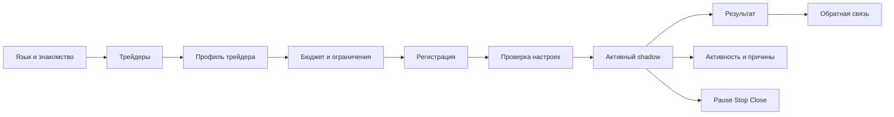
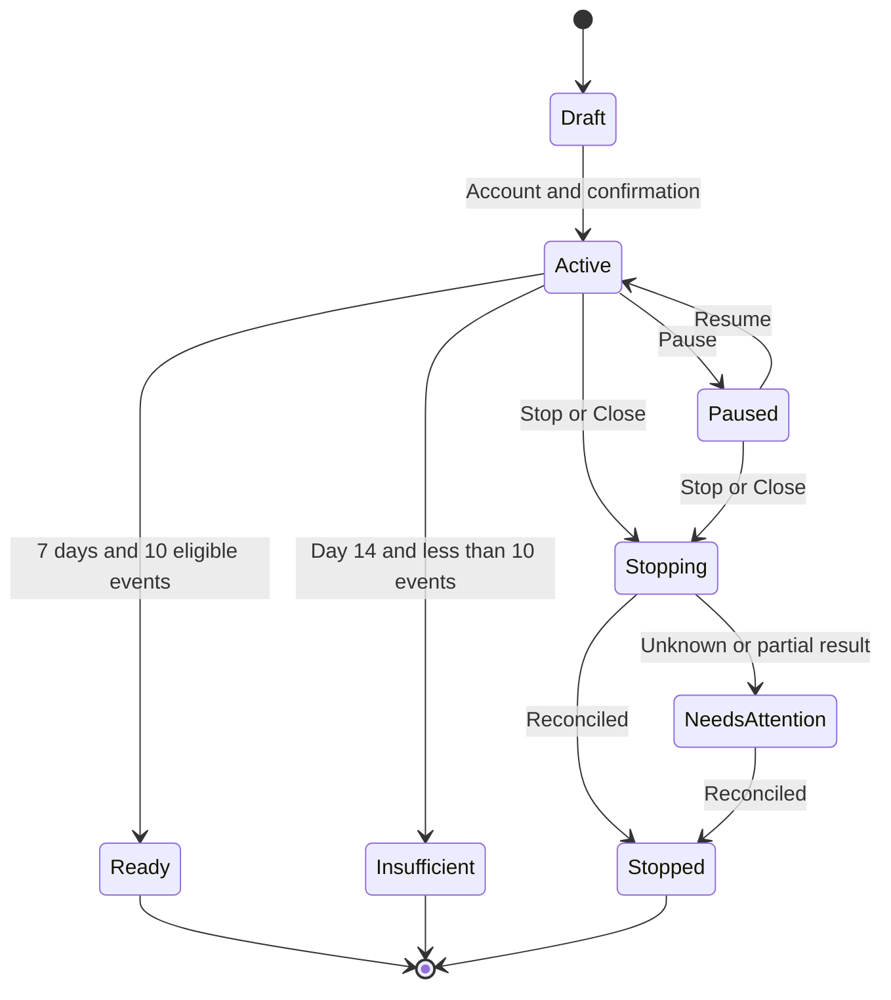

# Карта экранов и состояний paper MVP

Дата: 28.09.2026. Статус: спецификация для low-fidelity прототипа на основе ADR-0010 и ADR-0011.

## Основной поток

До регистрации доступны A–D. Возврат назад не теряет локальные черновые параметры в пределах текущего устройства. Запуск и сохранение shadow требуют аккаунта.

## Пользовательские экраны

| ID | Экран | Основное содержание | Ключевые действия |
|---|---|---|---|
| U01 | Язык | English, Русский | выбрать язык |
| U02 | Знакомство | что копируется, paper-маркировка, расходы, возможность потерь | посмотреть трейдеров |
| U03 | Трейдеры | рейтинг, фильтры, площадка, пригодность бюджета, ручной адрес | открыть профиль |
| U04 | Профиль трейдера | качество копирования, период, расходы, просадка, копируемость, рынки | начать shadow |
| U05 | Бюджет | диапазон, ползунок, точный ввод, свободный виртуальный бюджет | продолжить |
| U06 | Ограничения | максимум позиции, дневной лимит, возраст события, пресет с явными значениями | продолжить |
| U07 | Регистрация | объяснение сохранения сессии, минимальная форма аккаунта | создать аккаунт, войти |
| U08 | Проверка настроек | трейдер, площадка, бюджет, лимиты, 0% фактически, виртуальная комиссия | запустить shadow |
| U09 | Главная | свободно, выделено, зарезервировано, активные сессии, важный статус | открыть сессию |
| U10 | Активный shadow | прогресс 7 дней/10 событий, текущая симуляция, свежесть данных | активность, управление |
| U11 | Активность | скопировано, частично, пропущено, неизвестно, причины | открыть событие |
| U12 | Деталь события/позиции | рынок, сторона, сумма, цена, расходы, время, статус, причина | помощь, ручное paper-закрытие |
| U13 | Результат shadow | баланс, P&L после виртуальных расходов, просадка, копируемость, пропуски | отзыв, новая проверка |
| U14 | Управление | Pause, отключить и оставить, закрыть и отключить | подтвердить действие |
| U15 | Профиль и настройки | язык, in-app, Telegram, поддержка, feedback | сохранить настройки |

Bottom navigation показывается на U03, U09, U11 и U15 как `Главная / Трейдеры / Активность / Профиль`. Вложенные экраны используют понятный возврат и сохраняют контекст.

## Обязательные варианты экранов

| Состояние | Что видит пользователь | Что разрешено |
|---|---|---|
| Loading | skeleton с названием загружаемого блока | возврат и безопасная навигация |
| Empty | причина отсутствия данных и следующий шаг | перейти к трейдерам или изменить фильтр |
| Stale data | время последнего обновления и предупреждение | просмотр; новые рискованные действия блокируются при превышении порога |
| Venue unavailable | какая площадка недоступна и что затронуто | просмотр, Pause, Stop, Close request |
| Insufficient budget | минимальная сумма и причина | изменить бюджет или выбрать другого трейдера |
| Daily limit reached | использовано/доступно и время обновления лимита | выходы и снижение риска |
| Signal too old | фактическая задержка и установленный предел | просмотр; виртуальная покупка пропущена |
| Insufficient liquidity | ожидаемое ограничение исполнения | уменьшить будущий лимит; не повторять вслепую |
| Partially copied | исполненная и пропущенная части | детали и объяснение |
| Status unknown | система уточняет результат, новые рискованные действия остановлены | просмотр, Pause/Stop, обращение; без Retry order |
| Closing | закрытие запрошено, подтверждения ещё нет | отслеживать статус |
| Partially closed | закрытая и оставшаяся части | повторная оценка после сверки, не автоматический дубль |
| Close failed | причина и оставшийся риск | безопасные действия, обращение |
| Permission revoked | какие действия больше невозможны | просмотр и инструкция; live относится к будущему этапу |
| Not enough shadow data | срок, число событий и ограничение вывода | продолжить наблюдение или новую проверку |

Paper-интерфейс использует те же состояния исполнения, но всегда маркирует их как симуляцию. Он не показывает фиктивное подтверждение площадки.

## Состояния shadow-сессии

`Ready` означает достаточность отчёта, а не успешность стратегии. Пользователь может завершить Active или Paused раньше; такой отчёт маркируется `Прервано пользователем` и не получает итоговую оценку качества.

## Управление и подтверждения

| Действие | Новые покупки | Увеличение | Выходы лидера | Существующие позиции | Возобновление |
|---|---|---|---|---|---|
| Pause | нет | нет | да | продолжают отслеживаться | да |
| Отключить и оставить | нет | нет | нет | ручное управление, системные защиты | новая настройка |
| Закрыть и отключить | нет | нет | запрос закрытия | до подтверждения остаются видимыми | новая настройка после сверки |

В каждом подтверждении показываются текущие позиции, незавершённые действия и конкретные последствия. Сервисная комиссия ручного/защитного закрытия равна 0%, но прочие применимые расходы не скрываются.

## Операционная консоль

| ID | Раздел | Минимальное содержание |
|---|---|---|
| A01 | Overview | состояние площадок, свежесть событий, активные сессии, incidents, kill switches |
| A02 | Users | поиск, профиль, язык, timeline, shadow-сессии, позиции, уведомления |
| A03 | Incidents | UNKNOWN, partial, stale, reconciliation, close failures, владелец и журнал решения |
| A04 | Fees | версии paper/virtual тарифов, расчёт, effective dates, audit trail |
| A05 | Feedback | оценки понятности, причины отказа/остановки, обращения и экран возникновения |

Сквозные элементы: роль сотрудника, неизменяемый audit log, фильтр площадки и явная область действия остановки. Operator может остановить новые действия и запустить сверку; Support не меняет торговое состояние; Read only не выполняет действий.

## Аналитические события

Минимальный namespace:

- `onboarding.language_selected`, `onboarding.completed`;
- `trader.list_viewed`, `trader.profile_viewed`, `trader.address_searched`;
- `copy.setup_started`, `copy.budget_invalid`, `copy.review_viewed`;
- `account.prompt_viewed`, `account.created`, `account.prompt_abandoned`;
- `shadow.started`, `shadow.paused`, `shadow.resumed`, `shadow.completed`, `shadow.insufficient_data`, `shadow.stopped`;
- `activity.reason_viewed`, `control.stop_selected`, `control.close_selected`;
- `notification.telegram_connected`, `notification.telegram_disconnected`;
- `feedback.submitted`.

Каждое событие имеет версию схемы, locale, screen ID и псевдонимный user/session ID. Приватные ключи, seed phrase, секреты площадок и полный адрес без необходимости в аналитические свойства не попадают.

## Позднее

В карту первого прототипа не входят: wallet/funding, реальные разрешения, live execution, светлая тема как готовая реализация, WhatsApp/email/web push, агентский кабинет, подписка, ручное открытие произвольного рынка и объединённая ликвидность площадок.
