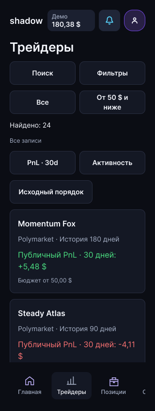

# Наполненный интерактивный пример: реализация и проверка

Дата: 02.10.2026. **Статус: готовы к проверке коллегой — 116 интерактивных экранов наполнены, структурная QA четырёх версий пройдена, 32 адаптивных контрольных композиции сохранены.** Это не утверждение полной пользовательской приёмки, произвольного поиска, API или реальных денежных операций.

Основание: [план 57](57_figma_work_plan_2026-10-02.md), [отчёт предыдущего пакета 58](58_figma_implementation_and_review_2026-10-02.md), [инструкция коллеге 54](54_colleague_figma_clickthrough_guide.md).

## 1. Зачем нужен этот пример

Проверить ощущение работающего продукта: длинные списки, поиск, фильтрацию, сортировку, периоды, детали и возвраты. Ранее подготовленные редкие исходы остаются отдельными состояниями. Количество нарисованных экранов само по себе не подтверждает, что данные, фильтры и переходы согласованы.

## 2. Отдельный вход и границы данных

В меню проверки добавляется самостоятельный вход **«Исследовать наполненный пример» / «Explore populated example»**. Это подготовленный набор синтетических данных, а не продолжение только что запущенной сессии и не результат настоящих сделок.

Сценарии до запуска (`before`), новой пустой сессии (`empty`) и существующего активного примера (`active`) не должны незаметно подменяться этим набором. Обычный запуск по-прежнему приводит к пустой сессии. Исследовательский пример открывается явным выбором; его финансовые значения и история остаются в собственном контексте. Возврат в обычные сценарии должен явно восстановить их defaults.

Демо и реальные счета двух площадок не складываются в общий расходуемый баланс. В данных каждой операции сохранены счёт, источник, период и статус. Синтетические суммы не утверждают методику PnL или ledger реального продукта.

## 3. Что проверяем в Figma

- Длинные списки трейдеров, позиций, событий, операций и сообщений, где последний элемент доступен прокруткой.
- Фиксированный viewport и контент выше него; закреплённая навигация не закрывает последние действия.
- Подготовленные запросы поиска и состояния «нет результатов» / «очистить».
- Фильтры меняют набор объектов, сортировки — порядок; видимый счётчик соответствует показанному набору.
- Период профиля меняет показатели и подписи, а не только оформление выбранной вкладки.
- Из списка открывается деталь того же объекта; возврат сохраняет контекст списка. Сохранение пиксельной позиции прокрутки принимается отдельно в Presentation.
- FAQ раскрывается внутри доступной области; поиск и тикеты сохраняют контекст обращения.

**Поиск Figma — подготовленные запросы.** Это не поле произвольного ввода и не поиск по настоящему адресу площадки. Переключение на готовый запрос должно быть понятно проверяющему. Если понадобится произвольный ввод и любые комбинации фильтров, потребуется отдельное решение о браузерном стенде на том же синтетическом наборе.

Не добавляются новые продуктовые фильтры, тарифы, рейтинги или обещания API только ради демонстрации. Future/live-сценарии отделены от текущего демо. FAQ не должен обещать работающие пополнение, вывод, регистрацию на площадках или успешные денежные операции, если показан только макет.

## 4. Итоговые входы и объём

| Версия | Исследовательский вход | Секция | Созданные экраны | Структурная QA | Presentation |
|---|---|---|---|---|---|
| Mobile RU | [Исследовать наполненный пример](https://www.figma.com/proto/lxPP2um7FvIbt02K8eeH4T?node-id=888-2163&starting-point-node-id=888%3A2163&page-id=33%3A2) | `888:1700` | 29 | 29/29 достижимы; перечисленные структурные дефекты — 0 | Каталог: длинный скролл и закреплённая навигация; выбранная деталь и возврат с сохранением места; Polymarket + положительный результат = 4, сортировка PnL сохраняет этот срез, prepared no-match = 0 с объяснением, сброс = 24 |
| Mobile EN | [Explore populated example](https://www.figma.com/proto/lxPP2um7FvIbt02K8eeH4T?node-id=905-8563&starting-point-node-id=905%3A8563&page-id=29%3A2) | `905:1753` | 29 | 29/29 достижимы; перечисленные структурные дефекты — 0 | не подтверждена |
| Desktop RU | [Исследовать наполненный пример](https://www.figma.com/proto/lxPP2um7FvIbt02K8eeH4T?node-id=905-9382&starting-point-node-id=905%3A9382&page-id=205%3A2) | `905:9073` | 29 | 29/29 достижимы; перечисленные структурные дефекты — 0 | Длинный каталог с закреплёнными шапкой/меню; Trader 22 → собственный профиль → возврат к месту; unknown-заявка → помощь с тем же контекстом; баланс → корректный демо-счёт и отдельные неподключённые реальные счета |
| Desktop EN | [Explore populated example](https://www.figma.com/proto/lxPP2um7FvIbt02K8eeH4T?node-id=905-10021&starting-point-node-id=905%3A10021&page-id=186%3A2) | `905:9712` | 29 | 29/29 достижимы; перечисленные структурные дефекты — 0 | не подтверждена |

Наполнены **116 экранов: 29 × 4 версии**. Полные IDs, карты экранов и результаты сканирования сохранены в [evidence](../design/qa-2026-10-02/interactive-data-evidence.json). Эти ссылки не означают завершённую пользовательскую приёмку всех комбинаций.

Объём синтетического набора: **24 трейдера, 19 позиций, 41 заявка, 70 событий, 33 исполнения, 20 уведомлений, 8 тикетов, 12 сообщений и 15 FAQ**. Это число объектов набора, а не число одновременно видимых строк. Один объект может быть показан на нескольких связанных экранах.

Источник — [синтетический набор](../design/interactive-fixtures-2026-10-02.json); [проверка связей и арифметики](../scripts/check-interactive-fixtures.mjs) проверяет IDs, статусы, количества исполнений, стоимость, резерв и результат именно этого примера. Наличие проверки не утверждает API или финансовую модель production.

Показатель успешных закрытых сделок вычисляется из целого числа выигрышных закрытых сделок и общего числа закрытых сделок. При отсутствии достаточной истории нет данных, а не выдуманный процент.

Текущий наполненный пакет показывает **все 24 трейдера, 19 позиций, 41 заявку, 70 событий, 33 исполнения/операции, 20 уведомлений, 8 тикетов, 12 сообщений и 15 FAQ**. Три представления сортировки каталога содержат 72 строки, но это те же 24 трейдера, а не 72 разных объекта.

Каждая строка открывает деталь своего объекта; семь семейств деталей заполняются связанными переменными. Это не обещание произвольного ввода или API. Для 6 трейдеров подготовлена подробная статистика по всем четырём периодам; остальные имеют карточку каталога и базовый профиль. Недостаток подробного покрытия не должен изображаться нулевой статистикой.

Графики — синтетические иллюстрации выбранного периода с согласованным началом и итогом. Они не являются историей настоящей рыночной цены, проверенным backtest или доказательством доходности трейдера.

В каждой площадке есть положительный, отрицательный, нулевой и недоступный результат за 30 дней. Подготовленный фильтр Polymarket + положительный результат должен дать **4 трейдера**; Limitless + положительный результат также **4**, а не создавать впечатление, что одна площадка всегда прибыльнее другой. Сортировка сравнивает сопоставимые доступные значения; отсутствующие данные не превращаются в ноль. Остальные конкретные запросы и проверки контролов будут зафиксированы после финальной evidence.

Финансовый снимок хранится в целых центах. Демонстрационный активный счёт:

| Показатель | Значение |
|---|---:|
| Денежный остаток, включая резерв | 186,17 $ |
| Зарезервировано | 5,79 $ |
| Доступно | 180,38 $ |
| Стоимость позиций по тестовой оценке | 23,60 $ |
| Общая оценка демо-счёта | 209,77 $ |
| Реализованный результат | +1,22 $ |
| Нереализованный результат | +8,55 $ |
| Общий результат | +9,77 $ |

Доступно + резерв = денежный остаток; денежный остаток + оценка позиций = оценка счёта. Резерв повторно к оценке не прибавляется. Тестовый расход исполнения 0,01 $ за fill и суммарно 0,33 $ — синтетическое условие набора, не предложение тарифа сервиса или комиссии площадок. Такой согласованный пример не подменяет проверку реальных цен, ликвидности, распределения комиссий и расчётов.

Проверки RU mobile и RU desktop не переносятся автоматически на EN или все остальные длинные списки. Desktop RU: `order-other-05` показывает 0/5 исполнено, резерв 1,01 $ и запрет слепого повтора; контекст помощи сохраняет именно эту заявку. Переход по балансу показывает доступно 180,38 $, резерв 5,79 $, оценку позиций 23,60 $ и оценку счёта 209,77 $, отдельно от неподключённых Polymarket/Limitless.

Для открытых позиций фильтр результата использует текущую нереализованную оценку; для закрытых — реализованный результат. Закрытая позиция не показывается как нулевой результат только из-за отсутствия текущей рыночной стоимости. В журнале групповые заголовки дат скрываются вместе с полностью скрытой группой событий.

## 5. Восемь заданий коллеге

Все задания повторяются на ПК/мобильном, RU/EN. Одинаковыми должны быть данные, возможности и последствия; композиция может различаться.

| № | Что сделать | Ожидаемый результат |
|---|---|---|
| 1 | Явно открыть наполненный пример; пролистать каталог до конца | Понятна маркировка тестового набора; последняя карточка и её действие доступны, навигация не закрывает контент |
| 2 | Выбрать подготовленный запрос, открыть пустую выдачу, очистить поиск | Видимая выдача меняется; «нет результатов» отличается от ошибки; очистка возвращает документированный исходный набор |
| 3 | Применить фильтр, изменить сортировку, сбросить | Фильтр меняет состав, сортировка меняет порядок того же состава; счётчик и активные признаки соответствуют данным |
| 4 | Из середины списка открыть трейдера; переключить периоды; вернуться | Данные относятся к тому же трейдеру и выбранному периоду; фильтр/порядок списка сохраняются; фактическое сохранение места фиксируется отдельным результатом |
| 5 | Открыть открытые и закрытые позиции, деталь и связанные события | Сохраняются IDs и смысл связи; закрытая позиция не предлагает повторное закрытие; отменённая без исполнения заявка не становится позицией |
| 6 | Отфильтровать события, открыть событие с неизвестным исходом и вернуться | Статус unknown не выдаётся за отказ или исполнение; нет слепого повтора; возвращается тот же фильтр и набор |
| 7 | Открыть средства и историю конкретного счёта, применить подготовленный фильтр | Нет смешения демо/Polymarket/Limitless; отсутствуют выдуманные подтверждения реального вывода или общей доступной суммы |
| 8 | Найти подготовленный FAQ, раскрыть ответ и открыть длинную переписку тикета; затем вернуться к обычному первому запуску | Последний ответ и действие доступны; контекст помощи сохраняется; первый запуск не получает чужую активную историю |

Замечание: **версия и язык → ссылка → действия → ожидание → результат → насколько мешает**. Для прокрутки отдельно указать устройство/размер окна, последнюю доступную строку и что закрывает закреплённая панель.

## 6. Как проверяем технически

[Read-only helper](../design/qa-2026-10-02/audit-interactive-data.js) принимает фактические page/section/frame IDs и проверяет: viewport, наличие длинного прокручиваемого контента, зоны нажатия 44×44, удалённые назначения, структурную достижимость новых экранов с обходом условных действий и пересечения секций/экранов. Конфигурация без стартовых IDs или ожидаемых размеров означает отсутствие покрытия, а не успешную проверку.

Фактический итог по каждой из четырёх версий: 29/29 ожидаемых экранов достижимы; **0 отсутствующих экранов, отсутствующих назначений, зон меньше 44×44, несоответствий viewport, выходов текста за границы кнопки, структурных проблем scroll-container, пересечений экранов и секций**. Это проверка нового наполненного пакета, не повторное объявление всего исторического файла бездефектным.

Созданы **32 Reference-only композиции**: каталог, позиции, подробный FAQ и переписка × два размера × четыре версии. Мобильные размеры 320/360 px, desktop 1024/1280 px. У копий нет прототипных реакций; оригинальные IDs и пути сохранены. По возвращённым данным создания: 0 diagnostics и 0 выходов текста за границы кнопок. Полный список reference IDs — в evidence. Статическая композиция не заменяет браузерный reflow и проверку жестами.

Для 320 px добавлена компактная мобильная шапка `919:2`; основной mobile-header `819:294` приведён к расположению в потоке, иконка позиций `819:306` использует портфель. Заголовок desktop-header `819:330` использует заполняемую ширину, 26 px и интерлиньяж 34 px для исправления обрезки. Кнопки допускают перенос текста с автоматической высотой и минимумом 48 px. Эти изменения не меняют смысл навигации между устройствами.

Сканирование настроек не подтверждает настоящие жесты прокрутки, сохранение позиции, работу всех комбинаций переменных или смысл фильтра. Эти пункты принимаются в Presentation по заданиям выше. Работа клавиатуры, screen reader, произвольный ввод, reflow браузера, API и финансовые расчёты остаются отдельной проверкой будущего интерфейса.

## 7. Что осталось проверить

- Пройти восемь заданий в Presentation на всех четырёх версиях и зафиксировать фактический результат; отдельный RU mobile-проход каталога не покрывает весь пакет.
- Проверить Limitless + положительный результат = 4 в Presentation: число подтверждено составом набора, но браузерный проход этой комбинации ещё не выполнен. Polymarket + положительный результат = 4 уже подтверждён браузерным проходом.
- Проверить все подготовленные запросы, сортировки и возвраты из каждого семейства деталей, включая непрочитанные уведомления и сохранённый контекст тикета.
- Решить, требуется ли браузерный стенд: после проверки Figma, без автоматического запуска разработки.

Дополнительная проверка после исправления общих шапок: на 116 основных и 32 контрольных экранах выходов текста за границы header не найдено. Подпись графика скрывается вместе с графиком, когда для выбранного периода нет подробных данных.

## Контрольный снимок

Каталог RU на 320 px после исправления компактной шапки. Это снимок Figma-композиции, а не работающего frontend.

