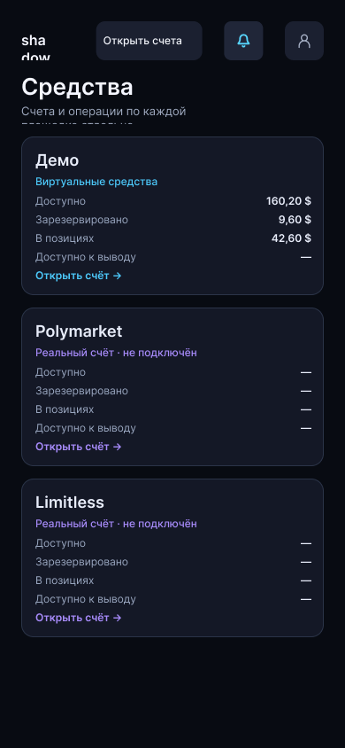
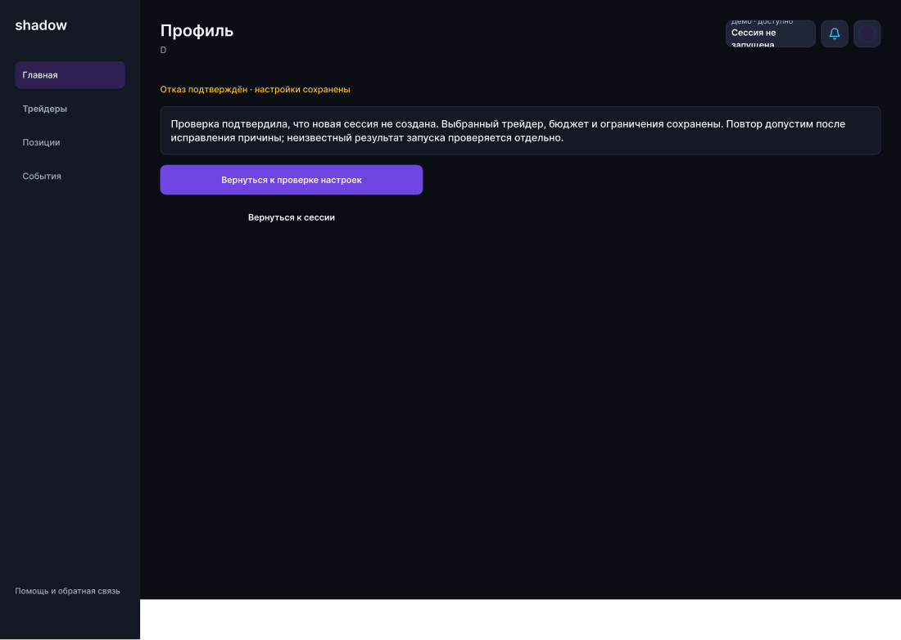
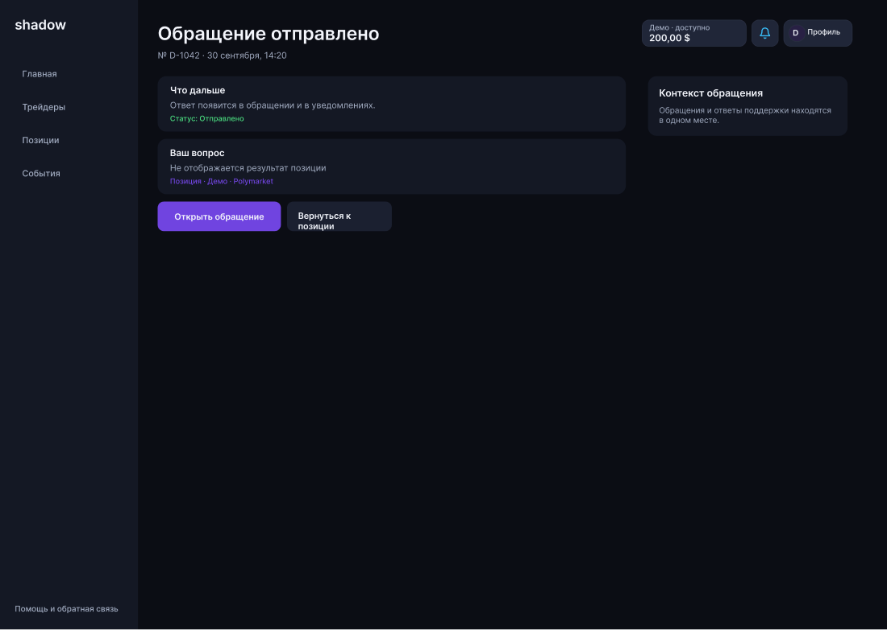

# Аудит всего шаблона Figma: оформление, компоновка и понятность

Исторический аудит. После согласования правки внесены; фактический результат и ограничения проверки — [отчёт62](62_visual_audit_fixes_2026-10-02.md). Исходные находки ниже сохранены.

Дата: 2 октября 2026 года. Статус: **предложения для согласования; правки в макеты не внесены**.

## 1. Вывод

Шаблон пока нельзя считать единым, готовым к передаче в разработку. Основная проблема — повторяющиеся ошибки общих компонентов и сосуществование нескольких вариантов одного сценария. Новые насыщенные данными экраны и прежние экраны отличаются плотностью, названиями действий и представлением показателей. Исправлять нужно сначала общую систему, затем экраны, иначе расхождения вернутся.

Сохраняем тёмную тему, Inter и существующее направление оформления. Современность интерфейса достигаем ясной иерархией, предсказуемой навигацией, читаемыми данными, аккуратной сеткой и последовательными состояниями. Добавление декоративных эффектов само по себе проблему не решит.

Критические подтверждённые находки: неверный заголовок в семействе десктопных состояний, служебный текст вместо суммы в балансе, обрезание мобильной шапки и пояснений, недостаточный контраст текстовых ссылок в поддержке. Следом — выравнивание кнопок, неодинаковая высота карточек, разрозненные текстовые стили и конкурирующие варианты экранов.

## 2. Что проверено и пределы проверки

Проверена структура **всех 15 страниц файла**, текстовые слои, размеры интерактивных узлов с заданными переходами, авторазметка, стили, цветовые сочетания и возможное обрезание. Выборочно просмотрены оригинальные снимки проблемных экранов, компонентов и админки. Это не ручной просмотр каждого фрейма и не сертификация доступности работающего приложения.

| Страница | Верхнеуровневые фреймы | Назначение проверки |
|---|---:|---|
| 00 · Начать здесь | 1 | Вход в проверку и ясность выбора сценария |
| 01 · Приложение · EN | 245 | Мобильные экраны и состояния |
| 02 · Приложение · RU | 245 | Мобильные экраны, русский текст |
| 03 · Десктоп · EN | 238 | Десктопные экраны и состояния |
| 04 · Десктоп · RU | 238 | Десктопные экраны, русский текст |
| 05 · Админка | 26 | Рабочие панели, инциденты, будущие разделы |
| 06 · Правила дизайна | 2 | Соответствие правилам проекта |
| 07 · Компоненты | 5 | Композиции и 77 компонентов/наборов вариантов |
| 08 · Проверка качества | 3 | Критерии приёмки |
| 90–95 · Архив | 66 | Отделение исторических вариантов от актуального продукта |

Всего 1069 фреймов, включая дубли языков, состояния, справочные и будущие варианты; это **не 1069 самостоятельных продуктовых страниц**. В четырёх пользовательских страницах — 966 фреймов.

Положительные результаты: в этих четырёх страницах сканирование не обнаружило текстов меньше 12 px и интерактивных узлов с заданными переходами меньше 44 × 44 px. Это не гарантирует, что все визуальные элементы, выглядящие кнопками, подключены и имеют правильную область нажатия. Ранее выявленные цифры про маленькие зоны нельзя автоматически переносить на сегодняшнюю версию.

Браузерную адаптивность, увеличение до 200%, клавиатуру, экранный диктор и фактическую работу фильтров нужно проверять отдельно. Геометрические предупреждения об обрезании не равны подтверждённым дефектам: например, верхние действия сторис визуально помещаются, хотя увеличенные области нажатия дают предупреждения.

## 3. Исправления в первую очередь

P0 — нарушает понимание экрана или денежных данных. P1 — мешает чтению, действию или последовательности интерфейса. P2 — систематизация и подготовка к разработке.

| № / приоритет | Находка и пример | Предлагаемая правка | Критерий приёмки |
|---|---|---|---|
| 1 · P0 | В проверенном семействе десктопных состояний повторяется заголовок «Профиль» / Profile и подзаголовок D. Сканирование нашло по 106 таких текстовых слоёв в каждой десктопной локали, соответствующих 53 парам. На экране ошибки запуска это подтверждено визуально. | Исправить свойства общего компонента шапки и передать каждому состоянию настоящий заголовок и пояснение. | Ошибка запуска называется «Не удалось запустить сессию»; другие состояния имеют собственные названия. Нигде не остаётся D как пользовательского подзаголовка. |
| 2 · P0 | На [ошибке запуска RU](https://www.figma.com/design/lxPP2um7FvIbt02K8eeH4T?node-id=807-64) фраза «Сессия не запущена» находится внутри баланса и обрезана. | Разделить свойства суммы, контекста счёта и состояния страницы. Баланс показывает только денежную информацию; ошибка располагается в содержимом. | Сумма, режим и валюта читаются полностью; сообщения о запуске не попадают в денежную плашку. |
| 3 · P1 | В [мобильных «Средствах» RU](https://www.figma.com/design/lxPP2um7FvIbt02K8eeH4T?node-id=270-129) бренд переносится на sha / dow, пояснение под заголовком обрезано. | Запретить перенос бренда; дать текстам естественную высоту; закрепить минимальную ширину действий шапки. Для узкой версии использовать предусмотренный компактный вариант бренда. | На 320/360/390 px логотип, сумма, колокольчик и профиль помещаются; пояснение видно целиком. |
| 4 · P1 | Текстовые ссылки и подписи поддержки используют #7044E0 на #141824: расчётный контраст около 3,03:1. Примеры: «Связь приложена», ссылки на связанный объект и обращение. | Создать отдельный более светлый токен для акцентного текста. Проверять цвет текста отдельно от фона основной кнопки. | Обычный текст имеет минимум 4,5:1 во всех состояниях; акцент остаётся узнаваемым. |
| 5 · P1 | В [отправленном обращении](https://www.figma.com/design/lxPP2um7FvIbt02K8eeH4T?node-id=673-283) «Вернуться к позиции» переносится и выглядит смещённым вниз. Геометрический анализ нашёл 13 аналогичных десктопных кнопок RU со смещением центра текста примерно на 7 px. | Общий компонент кнопки: одинаковые верхний/нижний отступы, центрирование, подходящая ширина для подписи. На десктопе не переносить короткую подпись при наличии свободного места. | Подпись и группа «иконка + текст» оптически и геометрически центрированы. Все 13 примеров проверены визуально. |
| 6 · P1 | Карточки метрик разной высоты из-за переноса пояснений. На профиле трейдера за 24 часа часть «Мало данных» помещается в одну строку, часть — в две. | Одинаковая высота карточек внутри ряда, единый нижний блок пояснения, выравнивание по общей сетке. Не задавать всем карточкам проекта одну жёсткую высоту. | В одном ряду совпадают верхние и нижние границы; длинный RU-текст не обрезан. |
| 7 · P1 | Старые и новые варианты каталога/профиля выглядят как разные продукты; часть новых фреймов в исходном состоянии показывает «Выберите запись». | Утвердить один актуальный маршрут и визуальный вариант. Проверить выбранного трейдера при входе из каталога и прямом открытии; предусмотреть понятное пустое состояние. | После выбора трейдера открываются его данные и следующий шаг; пустой профиль не выглядит завершённым основным экраном. Старые версии обозначены справочными. |
| 8 · P1 | В насыщенном мобильном каталоге слишком много отдельных фильтров перед списком. | Основная строка: поиск; далее «Фильтры» и «Сортировка». Развёрнутые настройки — в панели, выбранные ограничения — компактными чипами. | Первый результат виден без длинного прокручивания панели; фильтры доступны и их применение объяснимо. |
| 9 · P1 | В вариантах профиля и настроек не везде ясно, где показатель, где настройка, где действие; фиолетовое число может выглядеть ссылкой. | Данные показывать обычным текстом; настройки — полями/выбором с подписью; действия — кнопками или явно обозначенными ссылками. | Пользователь отличает значение от редактирования без пробного нажатия. |
| 10 · P1 | Разные виды шапки дают разный доступ к балансу и профилю. | Одна модель: денежный контекст → уведомления → личный профиль; одинаковая логика на ПК и мобильном. Размеры адаптируются, смысл и порядок сохраняются. | Любой экран ведёт в «Средства», уведомления и личный профиль. Общий остаток разных площадок не выдаётся за единый доступный баланс. |
| 11 · P1 | Периоды RU встречаются как 24h / 7d / 30d / 90d; денежные числа и дефисы оформлены неодинаково. | Единые правила локализации для периодов, денежных сумм, процентов, знака минуса, времени и статусов. | RU: «24 часа», «7 дней», «30 дней», «90 дней»; например 160,20 $, −0,40 $. EN использует собственный согласованный формат. |
| 12 · P1 | Графики и карточки результата могут смешивать публичный результат трейдера, историческую симуляцию и личное копирование. | У каждого показателя указать субъект, период, единицу и тип результата. Для отрицательных результатов график должен сохранять знак и нулевую линию. | Нельзя принять публичный PnL за личный заработок; направление графика соответствует положительным/отрицательным значениям. |
| 13 · P2 | Около 87% текстовых слоёв четырёх пользовательских страниц не имеют именованного текстового стиля: 21 311 из 24 465. | Привязать тексты к ролям существующей типографической системы, оставив только документированные исключения. | Новый текст выбирается из утверждённых ролей; изменение роли централизованно меняет связанные экземпляры. |
| 14 · P2 | Есть множество локальных отступов 6/10/14 px и нескольких близких фиолетовых оттенков. | Утвердить ограниченную шкалу и семантические цветовые роли; явно записать допустимые оптические исключения. | Основные интервалы и цвета привязаны к токенам. Не округлять механически каждый размер: сначала проверить назначение элемента. |
| 15 · P2 | Библиотека содержит старые и новые компоненты, неполные наборы состояний; в примере статусных вариантов одно слово Demo окрашено как успех, ошибка и другие состояния. | Назначить актуальные компоненты; показать реальные подписи статусов; дополнить состояния переключателей, полей и фильтров по назначению. | Ошибка обозначена как ошибка, демо — как режим; у необходимых контролов есть focus, disabled, loading/error. У кнопок часть этих вариантов уже существует, её сохраняем. |
| 16 · P2 | В админке основная сетка аккуратная, но все 934 проверенных текстовых слоя без именованных стилей; отдельные примитивы отличаются от пользовательской библиотеки. | Общие основы цвета/шрифта, отдельная плотность для операторских таблиц. Согласовать кнопки, денежные единицы, время и статусные метки. | Таблицы читаются, значения выровнены, критическое действие отличается от навигации; английская операторская демо-версия не ошибочно считается готовой RU-версией. |

### Наглядные примеры

Мобильные «Средства»: перенос бренда и обрезанное пояснение.

Десктоп: ошибочный заголовок и сообщение в поле баланса.

Поддержка: слабый акцентный текст и перенос во вторичной кнопке.

## 4. Единые правила компоновки для согласования

Это правила проекта, а не универсальный закон для каждого интерфейса. Основа — [действующий стандарт](41_product_design_and_frontend_standards.md).

### Сетка и отступы

- Шкала: 4, 8, 12, 16, 20, 24, 32, 40 px. Крупные композиционные интервалы допускаются отдельно, с понятным назначением.
- Мобильные внешние поля: 20 px на 360/390 px; 16 px на 320 px. Внутренний отступ карточки обычно 16–20 px. Между разделами — 24–32 px, между связанными строками — 8–12 px.
- Десктоп: поля контента от 24 px, ограниченная ширина основного содержимого 1200–1280 px. Для профиля/настроек — основной блок и боковое резюме; карточки не растягивать бесконечно на широком экране.
- Связанные карточки в одном ряду имеют общие границы. Высоту задаёт содержимое и минимальная высота, а не случайная фиксированная рамка.
- Текст, числа и действия выравниваются по стабильным колонкам. Суммы — вправо и с табличными цифрами; подписи — влево. Колонка денег не ужимается до переноса валюты.
- Большое пустое пространство допустимо, когда отделяет задачи. В сторис фиксированная огромная карточка с несколькими строками ослабляет пример: предлагаю уменьшить её или добавить наглядное действие, сохранив нижнюю кнопку в устойчивом месте.

### Кнопки и их положение

- Одна основная кнопка на шаг: «Продолжить», «Запустить демо», «Отправить обращение» — по задаче экрана. Другие действия имеют меньший визуальный вес.
- В общей шапке сохраняем порядок средств, уведомлений и профиля; в локальных формах — одинаковый порядок основной и вторичной кнопки в рамках выбранного шаблона.
- На мобильном основное действие внизу шага может быть на всю ширину внутри общих полей. Длинные формы — с закреплённой панелью и нижним отступом, чтобы панель не перекрывала содержимое.
- «Прижать к краю» означает к границе колонки/карточки с безопасным внутренним отступом. Иконки не касаются бордюра; блок действий не плавает между центром и левым краем на соседних экранах.
- Иконка с подписью — единая группа с интервалом около 8 px. В кнопке группа центрирована; в строке навигации иконка закономерно слева. Эти два случая нельзя выравнивать одинаково.
- Пауза: иконка паузы + спокойный предупреждающий цвет. Возобновление: иконка воспроизведения. Настройки: ползунки/шестерёнка. Завершение: отдельное опасное действие с подтверждением и объяснением последствий.
- Минимальная мобильная зона нажатия проекта — 44 × 44 px; визуальная иконка может быть меньше. Новые зоны не должны накладываться на соседние действия.

### Типографика и надписи

Используем существующие роли: крупный заголовок 24/32, заголовок раздела 20/28, малый заголовок 16/24, основной текст 16/24, вторичный 14/20, подпись 12/16. Display 32/40 — для уместных крупных заголовков; числовой стиль — для ключевых метрик. Не каждый текст обязан быть 16 px: важны роль, читаемость и последовательность.

Подпись 12 px предназначена для второстепенных данных, а не важного условия риска или объяснения финансового действия. Длинный русский текст получает естественную высоту; нельзя уменьшать шрифт ради размещения. Переносы проверять в полном экране, а не только внутри компонента.

Заголовок называет объект или задачу: «Позиция», «Заявка», «Событие», «Средства», «Настройки копирования». Неисполненная заявка не называется открытой позицией. «Связь приложена» заменить на понятное «Контекст приложен» с указанием объекта. Для недостаточных данных показывать объяснение и следующий доступный шаг, а не загадочный прочерк без подписи.

### Цвет и состояния

Разделить токены фона акцентной кнопки, акцентного текста и выбранного состояния. Фиолетовый выделяет основное действие/выбор; зелёный — подтверждённое положительное состояние; предупреждение — янтарное; ошибка/отрицательное изменение — соответствующая семантическая роль. Демо обозначает режим, поэтому его метка не должна автоматически выглядеть как успешная операция.

Статус всегда имеет название, при необходимости иконку. Положительный/отрицательный PnL имеет знак; цвет дополняет число. «Отменено», «Закрыто», «Ожидает исполнения», «Исполняется», «Не удалось» визуально и смыслово различаются. Отмена заявки и закрытие позиции — разные действия и разные результаты.

Основной текст требует контраста 4,5:1, крупный — 3:1; необходимые графические признаки контролов — 3:1. Неактивные контролы, логотип и декоративные символы нельзя включать в общий счёт нарушений обычного текста. Найденные фиолетовые текстовые ссылки требуют исправления, а не осветления всей палитры без разбора.

## 5. Доработки по семействам экранов

| Семейство | Что проверить и привести к единому виду |
|---|---|
| Первый вход, сторис, возвращение | Единый входной маршрут; чёткий следующий шаг; демо доступно без 2FA; наглядный пример выбора трейдера и ограничений. Не требовать чтения всей справки до первого действия. |
| Главная и активная сессия | Отделить доступные средства, сумму в позициях и результат; карточка «В позициях» ведёт к списку; порядок действий и статусов одинаков по устройствам. |
| Каталог и профиль трейдера | Одинаковые смысловые данные и периоды; компактная панель фильтров; публичные метрики отдельно от личной истории; устойчивое действие настройки копирования и корректное состояние без выбранного трейдера. |
| Настройки и риски | Явно показать глобальные значения и переопределения трейдера, наследование и возврат к глобальным; пресеты — выбор, расширенные настройки — отдельное раскрытие. |
| Позиции, заявки, события | Общая структура карточки: объект, площадка, статус, объём/сумма, результат, время; детали открываются из строки. Все финансовые значения и действия соответствуют типу объекта. |
| Средства | Раздельные счета Demo/Polymarket/Limitless; доступно, зарезервировано, в позициях, доступно к выводу. Неизвестное значение объясняется, не подменяется нулём. Демо не ведёт в реальные операции; 2FA относится к реальным деньгам. |
| Уведомления и профиль клиента | Колокольчик доступен на обоих устройствах; непрочитанное состояние не только цветом; личный профиль доступен напрямую; ссылка на рефералку, условия и статистика внутри профиля. |
| Помощь и тикеты | Раскрытый ответ не обрезается; обращение, статус, переписка и приложенный объект читаемы; сохранить путь возврата к позиции/сессии/средствам. |
| Вход, регистрация и будущие live-экраны | Согласованные поля, ошибки, состояние ожидания и следующий шаг; не показывать заглушку как реализованную операцию. Отдельно учитывать подтверждение денежных действий. |
| Админка | Отдельный операторский контекст; выровненные таблицы, ясные состояния инцидента, единицы и часовой пояс. В примерах графиков пояснить порог/единицу, а не считать линию очевидной. Будущие финансы владельца не выдавать за подключённые данные. |

Эти пункты — требования к следующему проходу, а не утверждение, что каждый перечисленный раздел сейчас сломан. Существующие удачные решения сохраняем.

## 6. Порядок выполнения после согласования

1. **Исправить смысловые ошибки шапки и денег.** Проверить весь набор повторяющихся заголовков; убрать сообщения из поля суммы. Выбрать актуальные маршруты и отделить справочные варианты.
2. **Утвердить основы и компоненты.** Семантические цвета, текстовые роли, сетка, шапка, кнопки, статусы, строки данных и карточки. Заменять экземпляры после проверки свойств и переходов, не удалять старые узлы вслепую.
3. **Довести контрольные экраны RU.** Главная, профиль трейдера, настройка, позиция, средства, поддержка. Проверить мобильные 320/360/390 px и десктопные 1024/1280/1440 px. Выбранные размеры — контроль адаптации, не требование вручную плодить все состояния на каждой ширине.
4. **Распространить систему на остальные экраны и EN.** Проверить длинные подписи, состояния без данных, загрузку, ошибки, отмену, закрытие, ожидание и исполнение. Проверять выбранное состояние в прототипе, а не только исходный фрейм с переменными по умолчанию.
5. **Проверить связность и функциональное равенство.** Одинаковые задачи на ПК/мобильном и в RU/EN; одна модель навигации; к каждому действию понятный результат и возврат. Сопоставить с аудитами 46/47 и замечаниями коллеги, чтобы визуальные исправления не уничтожили маршруты.
6. **Навести порядок для передачи.** Чёткие точки старта, пометки Current/Future/Reference, архив вне основного пути, краткая инструкция проверки и список ещё не реализованных сценариев. Сохранить ссылки на существующие узлы либо явно обновить их карту.

## 7. Приёмка и доказательства

Для каждой исправленной семьи нужны снимки до/после, перечень связанных экранов и проверка всех четырёх пользовательских сочетаний устройства/языка. На узких размерах нет обрезания, горизонтального прокручивания основного текста и перекрытия закреплёнными панелями. Кнопки читаются, строки сумм не ломаются, нажатия не пересекаются. Цвета и статусы последовательны; демонстрационные цифры сходятся в одном сценарии.

Геометрический анализ нашёл 17/20 кандидатов обрезания на мобильных EN/RU и 70/85 на десктопных EN/RU. Это очередь визуальной проверки, не число доказанных ошибок. После исключения символов и неактивных элементов повторная проверка RU нашла по 24 кандидата низкого контраста текста на мобильной и десктопной странице; повторяющиеся ссылки поддержки подтверждают проблему. Не суммировать эти числа с архивом и не выдавать их за уникальные сценарии.

Сырой результат и выборочные снимки сохранены в [папке проверки](../design/qa-2026-10-02/). [Машинный отчёт](../design/qa-2026-10-02/full-template-visual-audit.json) позволяет найти конкретные слои и повторить измерения. Архивные мелкие шрифты и старые состояния не включены в вывод о текущих пользовательских экранах.

Ориентиры: [WCAG — контраст текста](https://www.w3.org/WAI/WCAG22/Understanding/contrast-minimum.html), [WCAG — минимальный размер цели](https://www.w3.org/WAI/WCAG22/Understanding/target-size-minimum.html), [WCAG — перестроение содержимого](https://www.w3.org/WAI/WCAG22/Understanding/reflow.html). Минимум WCAG AA для цели — 24 px с оговорёнными исключениями; проект сознательно использует 44 px для мобильного интерфейса.

**Решение для согласования:** выполнить сначала пункты 1–6 таблицы и утвердить единые компоненты, затем распространять их на все семейства. Не начинать новую визуальную концепцию с нуля. Figma, код приложения и внешние документы в рамках этого аудита не изменялись; подготовлены только отчёт и материалы проверки.
