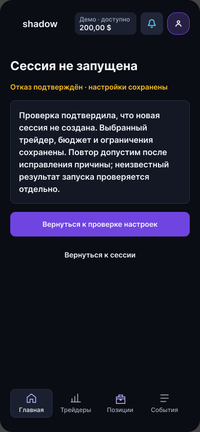
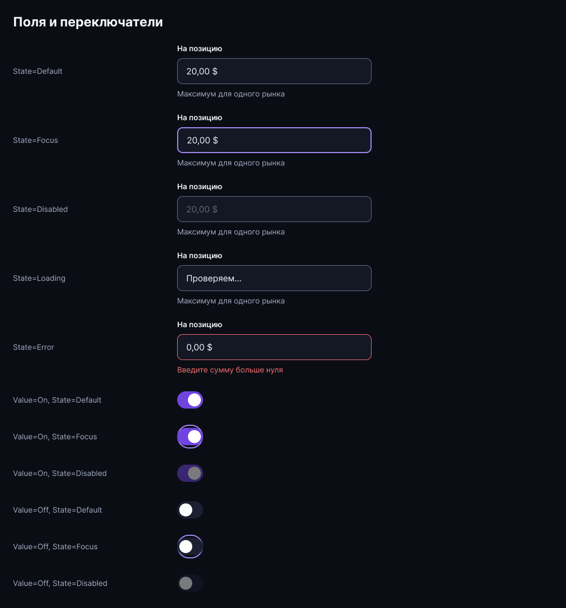

# Результат исправления визуального аудита Figma

Дата: 2 октября 2026 года. Статус: правки в Figma внесены; структурная и выборочная визуальная проверка завершены. Пакет передаётся коллеге для пользовательской приёмки. Это не утверждение готовности работающего приложения.

## Что завершено

Применены исправления общих компонентов и активных пользовательских страниц RU/EN для ПК и мобильного веба. Согласованы шапки, подписи навигации, иерархия текста, кнопки, цвета статусов, денежные значения и высота карточек. Проверены и исправлены ошибочные переходы на главную, которые могли увести подготовленную историю в пустое состояние.

Сохраняем две основные ширины: **1440 px ПК и 390 px мобильный веб**. Высота содержимого и прокрутка зависят от страницы. Новые макеты других разрешений не создавались. Прежние Reference-композиции сохранены как справочные материалы; адаптивность и увеличение текста проверяются при разработке.

## Результат по 16 группам аудита 60

| № | Группа | Выполнено / граница результата |
|---:|---|---|
| 1 | Заголовки ПК | Общий заголовок отделён от суммы и контекста баланса; исправлены служебные подписи в состояниях. |
| 2 | Баланс | Ошибки и сообщения о запуске вынесены в содержимое; в шапке остаются контекст счёта и денежное значение. |
| 3 | Мобильная шапка | Исправлены перенос shadow, ширина пояснений и высота баланса. Проверены выбранные экраны на 390;320/360 отложены согласно решению пользователя. |
| 4 | Контраст поддержки | Светлый текст акцентных ссылок связан с семантическим токеном; проверен экран отправленного обращения. Полная WCAG-приёмка браузера остаётся отдельной. |
| 5 | Кнопки | Общие семейства получили центрирование, внутренние отступы и заполнение доступной ширины подписью; исправлены вложенные группы длинных подписей. Визуальная проверка выборочная, не ручной просмотр всех 13 примеров. |
| 6 | Метрики | Выровнена высота карточек внутри рядов; структурная проверка активных страниц не нашла рядов с разной высотой. |
| 7 | Актуальный маршрут | Четыре старта и53 связанных состояния в каждой версии; заменённые пути остаются Reference и не используются основным маршрутом. Основание — исправления 61. |
| 8 | Каталог мобильного | Сохранены подготовленные связанные фильтры и сортировка, компактное размещение; это Figma-варианты, не произвольный поиск приложения. |
| 9 | Значение, настройка, действие | Значения используют числовые/основные стили, акцентные текстовые действия — отдельный токен. Дополнены состояния поля и переключателя; поведение клавиатуры предстоит реализовать. |
| 10 | Шапки и навигация | Общие masters, порядок средства → колокольчик → профиль; исправлены подписи мобильной навигации и условный возврат на главную ПК. |
| 11 | Форматы | Применены локализованные периоды, числовые стили, RU десятичные запятые и знаки денежных значений. Полную проверку всех динамических строк следует включить в локализационную приёмку frontend. |
| 12 | Результаты | Публичная статистика трейдера отделена от личной истории копирования, периоды и графики связаны в61; синтетические и недоступные данные обозначены. Реальные расчёты API не начинались. |
| 13 | Типографика | Все проверенные текстовые узлы активных пользовательских страниц и админки используют именованные стили; сохранён Inter. |
| 14 | Отступы и токены | Связаны применимые цвета, интервалы и радиусы; исправлены авторазметка и высота текстовых блоков. Оптические исключения не округлялись механически. |
| 15 | Библиотека | Сохранены Legacy-ID, отмечено справочное назначение. Добавлены Shared/Field Default / Focus / Disabled / Loading / Error и Shared/Switch On/Off × Default/Focus/Disabled. Статусы получили осмысленные подписи. |
| 16 | Админка | Общие текстовые и цветовые основы применены с сохранением операторской плотности. Выборочно проверен обзор; текущие примеры админки EN-only. |

Исторический аудит 60 сохранён. Эта таблица фиксирует фактический результат и не подменяет пользовательскую приёмку каждого экрана.

## Проверки и доказательства

- В четырёх актуальных маршрутах53 × 4 = 212 фреймов; структурно все достижимы, отсутствующих целей и переходов на заменённые пути нет.
- В основном маршруте нет интерактивных узлов с заданными переходами меньше 44 × 44 px. Это не оценка всех декоративных элементов и не браузерный тест доступности.
- Проверка типографики: mobile RU — 5912, mobile EN — 5911, desktop RU — 8612, desktop EN — 8612, admin — 940 текстовых узлов; без именованного стиля 0, семейство Inter.
- Выборочные визуальные проверки: каталог, мобильный кошелёк, отправленное обращение, состояние ошибки запуска, админский обзор, поля и переключатели.
- В Presentation пройден возврат подготовленной истории Главная→Трейдеры→Главная на RU mobile и RU desktop. На ПК после последнего исправления подтверждены правильная главная и баланс 180,38 $.
- Проверки структуры репозитория и относительных ссылок, синтетических fixtures и оформления diff проходят. Независимый агент подтвердил проверки документов и fixtures.
- Полный ручной проход всех EN/RU сценариев пока не выполнялся. Проверки клавиатуры, screen reader, увеличение200% и другие ширины относятся к работающему интерфейсу.

Данные подготовленного примера:24 трейдера, 19 позиций, 41 заявка, 70 событий; доступно180,38 $, зарезервировано5,79 $, в позициях23,60 $, стоимость счёта209,77 $, результат+9,77 $. Новый запуск — отдельное пустое демо с 200 $.

Evidence: [структурные результаты](../design/qa-2026-10-02/visual-fixes-evidence.json), [архив основных скриптов исправлений](../design/qa-2026-10-02/visual-fixes-patches.json). Архив содержит шаблоны с PID; это материал для проверки выполненных изменений, а не команда для повторного запуска вслепую.

## С чего начать коллеге

Основная инструкция и четыре ссылки — [документ 61](61_colleague_corrections_implementation_2026-10-02.md).

| Версия | Старт проверки |
|---|---|
| Мобильная RU | [Открыть](https://www.figma.com/proto/lxPP2um7FvIbt02K8eeH4T?node-id=888-2163&starting-point-node-id=888-2163&scaling=scale-down) |
| Мобильная EN | [Открыть](https://www.figma.com/proto/lxPP2um7FvIbt02K8eeH4T?node-id=905-8563&starting-point-node-id=905-8563&scaling=scale-down) |
| ПК RU | [Открыть](https://www.figma.com/proto/lxPP2um7FvIbt02K8eeH4T?node-id=905-9382&starting-point-node-id=905-9382&scaling=scale-down) |
| ПК EN | [Открыть](https://www.figma.com/proto/lxPP2um7FvIbt02K8eeH4T?node-id=905-10021&starting-point-node-id=905-10021&scaling=scale-down) |

1. Сначала выбрать «Подготовленная история демо»; сравнить шапку и навигацию ПК/мобильного.
2. Перейти Главная→Трейдеры→Главная: история и180,38 $ должны сохраниться.
3. Пройти фильтры, сортировку и пустой результат каталога; открыть трейдера, периоды 24 часа / 7 / 30 / 90 дней, историю личного копирования.
4. Пройти позиции→деталь→событие/заявку, включая отменённые, закрытые, частичные и неизвестные состояния. Отмена и закрытие — запросы с последующей сверкой, а не обещание мгновенного результата.
5. Нажать баланс: открыть средства, отдельный демо-счёт и будущие реальные счета. Остатки Polymarket/Limitless не складываются в общий расходуемый баланс.
6. Проверить профиль, помощь, раскрытый FAQ, тикет и переписку. Вернуться к исходному контексту.
7. Перезапустить прототип и выбрать первый вход: пройти знакомство→трейдер→риски→проверка→пустое демо. Прошлая подготовленная история здесь не должна появляться.
8. Повторить задачи на втором устройстве; EN пройти отдельно. Для замечания приложить ссылку на экран, действие, ожидаемый и фактический результат.

Приоритет приёмки: понятность следующего действия, отсутствие потери контекста, одинаковые возможности устройств, обрезанные подписи/переносы, различимость действий и значений, одинаковые смысловые цвета.

## Визуальные примеры после исправлений

Дополнительные оригинальные снимки: [средства](../design/qa-2026-10-02/visual-fixed-funds-ru.png), [отправленное обращение](../design/qa-2026-10-02/visual-fixed-support-sent-ru.png), [обзор админки](../design/qa-2026-10-02/visual-fixed-admin-overview.png).

## Что этим не реализовано

Frontend, API Polymarket/Limitless, реальные переводы и торговое исполнение не создавались. 2FA в демо нет; защита реальных средств относится к будущему security-контракту. Произвольный ввод в Figma заменён подготовленными состояниями. Финансовые модели, рейтинг и API-полнота требуют отдельной проверки до разработки. Видео-инструкция остаётся финальным этапом после приёмки экранов.

