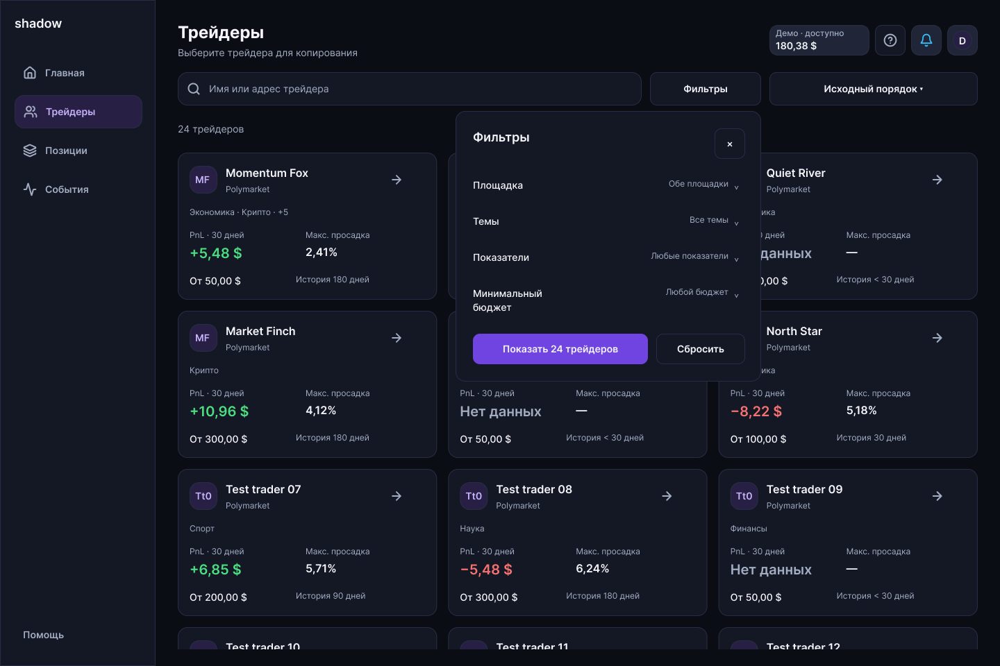

# Компактные фильтры, помощь и средства
Дата: 03.10.2026. Итерация восстановления согласованного интерфейса, ПК 1440 px / mobile 390 px, RU и EN.

## Что изменено
- Каталог: четыре раскрывающиеся группы — площадка, темы, показатели, минимальный бюджет. По умолчанию группы закрыты. Выбор площадки является условием каталога, а не переключателем всего приложения.
- Черновик отделён от применённых условий. «Показать» показывает количество совпадений и применяет выбор; закрытие отменяет неподтверждённые изменения. «Сбросить» в панели меняет черновик, результат меняется после применения.
- На mobile панель открывается снизу: длинное содержимое прокручивается, действия остаются внизу. Пункты выбора — строки с выравниванием слева и галочкой, а не набор одинаковых кнопок.
- На ПК панель шириной 440 px раскрывается под кнопкой, с выравниванием правого края. Нажатие вне панели закрывает её без применения черновика. В каталоге показатели за 30 дней, одинаково на устройствах; выбор периодов 24 часа / 7 / 30 / 90 дней остаётся в профиле трейдера.
- Активные условия: число на кнопке фильтров, максимум две плашки и +N. Поиск и сортировка используют ту же отфильтрованную выдачу. Поиск в Figma ограничен подготовленными примерами запросов; свободного API-поиска пока нет.
- Общая шапка: средства → помощь → уведомления → профиль. Помощь представлена иконкой вопроса в круге; открывает местный Центр помощи. Иконки имеют зоны 44 × 44 px. Mobile-логотип помещается в одну строку.
- Пока используется только демо, шапка показывает доступную сумму демо. Нажатие ведёт прямо в «Средства».
- Будущий сценарий реальных счетов показывает «Средства · 3 счёта», без суммирования остатков. Демо, Polymarket и Limitless остаются отдельными счетами. Это состояние Figma, а не подключённая финансовая интеграция. В рабочем продукте число должно вычисляться по доступным счетам; неподключённый счёт не получает выдуманный нулевой баланс.

## Проверка
Шапки проверены на 52 продуктовых состояниях каждой из четырёх версий. Служебный выбор сценария не является публичным стартом. Размеры помощи и локальные переходы проверены структурно; на самом экране помощи повторный переход не нужен.

На mobile RU и EN независимая проверка фактических реакций применения прошла 288 комбинаций для каждой версии, включая 78 пустых результатов. Это проверка тестовых условий, а не всех возможных числовых вводов.

На ПК RU и EN проверены все 288 доступных сочетаний × четыре подготовленных поисковых запроса = 1152 сценария для каждой локали. Интерпретатор фактических Figma-действий сверяет количество, точные ID карточек, пустую выдачу, плашки и закрытие панели; расхождений нет. Во время проверки исправлен устаревший счётчик положительного PnL в EN. Состав условий одинаковый на устройствах: 3 площадки включая «любая», 8 тем включая «все», 3 варианта показателей, 4 бюджета.

Пройденные в браузере сценарии:
1. ПК EN: Limitless → предварительно 12 → применение → 12 карточек; повторное открытие сохраняет выбор; сброс черновика и закрытие сохраняют ранее применённые условия.
2. Mobile RU: Limitless → 12 → применение. Помощь открывает Центр помощи; баланс оттуда открывает «Средства» с отдельными карточками.
3. Mobile EN: Политика → 2 → применение; прокрутка раскрытых тем сохраняет доступность действий. Limitless + Политика → 0 → пустая выдача с подсказкой; кнопка показывает два активных фильтра.
4. ПК RU: панель под кнопкой → Limitless → предварительно 12 → применение → 12 карточек и «Фильтры · 1»; открытие трейдера и возврат к каталогу сохраняют условия.

Скрипты, независимые проверки, ledger и изображения находятся в design/qa-2026-10-03. Общая приёмка всех старых экранов проекта остаётся отдельной задачей: этот отчёт подтверждает указанную итерацию.

## Ссылки для коллеги

- [ПК RU — каталог](https://www.figma.com/proto/lxPP2um7FvIbt02K8eeH4T?node-id=905-9096)
- [Mobile RU — каталог](https://www.figma.com/proto/lxPP2um7FvIbt02K8eeH4T?node-id=888-1734)
- [ПК EN — каталог](https://www.figma.com/proto/lxPP2um7FvIbt02K8eeH4T?node-id=905-9735)
- [Mobile EN — каталог](https://www.figma.com/proto/lxPP2um7FvIbt02K8eeH4T?node-id=905-1788)
- [Будущий сценарий счетов — ПК RU](https://www.figma.com/proto/lxPP2um7FvIbt02K8eeH4T?node-id=905-9404)
- [Будущий сценарий счетов — mobile RU](https://www.figma.com/proto/lxPP2um7FvIbt02K8eeH4T?node-id=888-2196)

## Что прокликать
1. Открыть фильтры; раскрыть одну группу, проверить компактность остальных.
2. Выбрать Limitless: до применения каталог прежний, на кнопке — 12. Применить, проверить площадки карточек.
3. Открыть снова, изменить условия и закрыть. Предыдущая выдача должна сохраниться.
4. Добавить «Политика» к Limitless: показать ноль, понятный пустой результат. Сбросить и применить: вернуться к 24 трейдерам.
5. Применить показатели и бюджет; проверить не более двух плашек и +N. Изменить сортировку, открыть трейдера и вернуться: условия должны сохраняться.
6. На mobile раскрыть длинную группу и прокрутить: нижние действия остаются доступны.
7. В шапке нажать помощь, уведомления, профиль и средства. Проверить одинаковый порядок на ПК/mobile.
8. Открыть будущие счета: общей суммы нет; реальные счета и демо имеют отдельные действия.

## Границы
Данные синтетические. Свободные поля, сетевой поиск, обновление баланса в реальном времени, подключение кошельков, денежные операции и 2FA не реализованы этой визуальной итерацией. Названия и правила тем описаны в [отчёте 65](65_chart_style_and_trader_topics_2026-10-03.md).
